# 🏗️ High-Level Design (HLD)
## DigiLocker Document Vault — System Architecture

---

> **Revision**: 1.0 | **Date**: August 17, 2026  
> **Architecture Style**: Three-Tier Monolithic (Frontend → REST API → RDBMS)

---

## 1. System Overview

DigiLocker Document Vault is a cloud-native document management system built on a three-tier architecture:

1. **Presentation Tier** — Next.js 14 (App Router) with React client components
2. **Application Tier** — Express.js REST API with middleware pipeline
3. **Data Tier** — PostgreSQL 15 with Prisma ORM and Cloudinary/local file storage

---

## 2. High-Level System Architecture

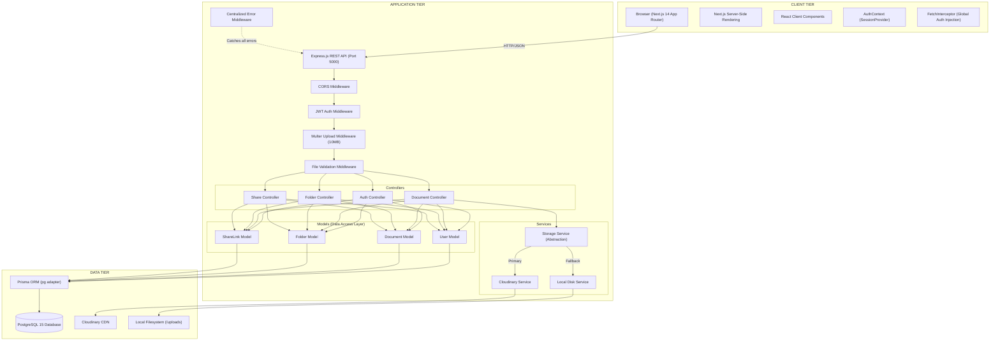

---

## 3. Component Architecture

### 3.1 Frontend Architecture (Next.js 14)

```mermaid
graph TD
    subgraph "App Router Pages"
        Landing["/ (Landing Page)"]
        Login["/login"]
        Register["/register"]
        Dashboard["/dashboard"]
        Profile["/profile"]
        Security["/security"]
        SharePage["/share/[token]"]
        Privacy["/privacy-policy"]
        Terms["/terms-of-service"]
        NotFound["not-found.jsx"]
    end

    subgraph "Shared Components"
        Navbar["Navbar (Search + Filters + Profile)"]
        Sidebar["Sidebar (Folders + Navigation)"]
        Header["Header (Breadcrumbs)"]
        DocList["DocumentList (Table View)"]
        DocCard["DocumentCard (Grid View)"]
        DocViewer["DocumentViewer (Preview Modal)"]
        UploadMod["UploadModal (Drag & Drop)"]
        ShareMod["ShareModal (Link Generation)"]
        MoveMod["MoveModal (Folder Relocation)"]
        ConfirmMod["ConfirmModal (Destructive Actions)"]
        InputMod["InputModal (Text Input Prompts)"]
        FolderCard["FolderCard"]
        Skeleton["SkeletonLoader"]
        ErrBound["ErrorBoundary"]
        Protected["ProtectedRoute"]
        FetchIntComp["FetchInterceptor"]
        GlobalPrompt["GlobalPromptHandler"]
        UploadProg["UploadProgress"]
    end

    subgraph "State Management"
        AuthContext["AuthContext (React Context)"]
        NextAuth["NextAuth.js SessionProvider"]
        LocalStorage["localStorage (Token Backup)"]
    end

    subgraph "Utilities"
        ApiClient["apiClient.js (Authenticated Fetch)"]
        DownloadHelper["downloadHelper.js (Force Download)"]
        PwValidator["passwordValidator.js (Client-side)"]
    end

    Dashboard --> Navbar & Sidebar & Header
    Dashboard --> DocList & DocCard & DocViewer
    Dashboard --> UploadMod & ShareMod & MoveMod & ConfirmMod
    AuthContext --> NextAuth
    FetchIntComp -->|"Injects Bearer token"| ApiClient
```

### 3.2 Backend Architecture (Express.js)

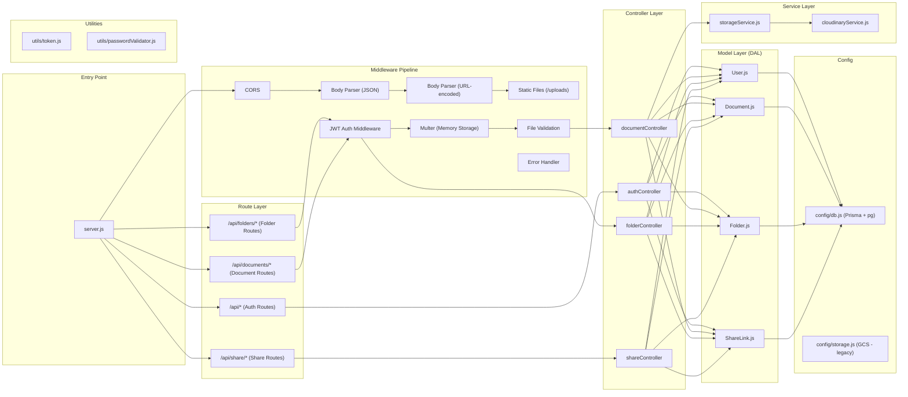

---

## 4. Data Architecture

### 4.1 Entity Relationship Diagram

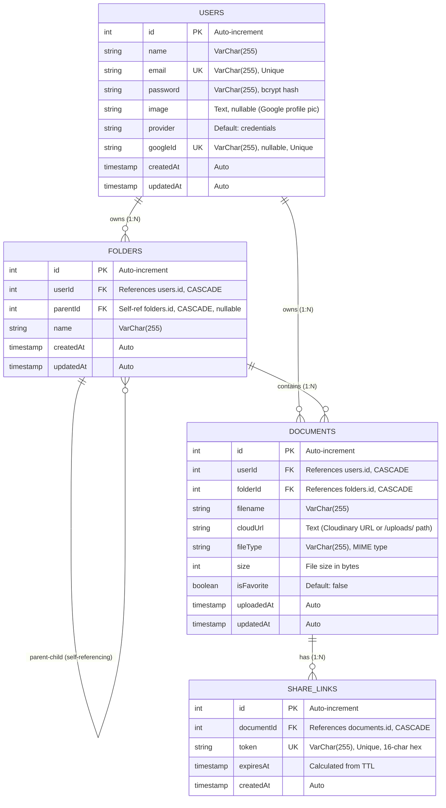

### 4.2 Database Indexes

| Table | Index Name | Column(s) | Purpose |
|---|---|---|---|
| `folders` | `idx_user` | `userId` | Fast folder lookup by owner |
| `folders` | `idx_parent` | `parentId` | Fast child folder resolution |
| `documents` | `idx_user_doc` | `userId` | Fast document listing by owner |
| `documents` | `idx_folder_doc` | `folderId` | Fast folder contents lookup |
| `share_links` | `idx_token` | `token` | O(1) token lookup for public access |
| `share_links` | `idx_document` | `documentId` | Fast share link resolution |

---

## 5. API Design

### 5.1 API Gateway Overview

All API endpoints are served under the `/api` prefix from the Express.js server on port `5000`.

| Category | Base Path | Auth Required | Controller |
|---|---|---|---|
| Authentication | `/api/` | Mixed | `authController` |
| Folders | `/api/folders` | All routes | `folderController` |
| Documents | `/api/documents` | All routes | `documentController` |
| Share Links | `/api/share` | POST only | `shareController` |

### 5.2 Complete API Contract

```
┌──────────────────────────────────────────────────────────────────────────────┐
│  AUTHENTICATION                                                              │
├──────────────────────────────────────────────────────────────────────────────┤
│  POST   /api/signup            → Register new user + auto-create folders    │
│  POST   /api/login             → Authenticate & return JWT                  │
│  POST   /api/auth/google       → Google OAuth login/register                │
│  GET    /api/profile           → Get user profile + storage usage    [AUTH] │
│  PUT    /api/user/email        → Update email address                [AUTH] │
│  PUT    /api/user/password     → Update password                     [AUTH] │
│  DELETE /api/user              → Delete account (cascade all data)   [AUTH] │
├──────────────────────────────────────────────────────────────────────────────┤
│  FOLDERS                                                             [AUTH] │
├──────────────────────────────────────────────────────────────────────────────┤
│  POST   /api/folders           → Create folder (name, parentId)             │
│  GET    /api/folders           → List all user folders                       │
│  PUT    /api/folders/:id       → Rename folder                              │
│  DELETE /api/folders/:id       → Delete folder (only if empty)              │
├──────────────────────────────────────────────────────────────────────────────┤
│  DOCUMENTS                                                           [AUTH] │
├──────────────────────────────────────────────────────────────────────────────┤
│  POST   /api/documents/upload  → Upload file (multipart, 10MB max)          │
│  GET    /api/documents         → List documents (paginated, filtered)       │
│  DELETE /api/documents/:id     → Delete document (storage + DB)             │
│  PUT    /api/documents/:id/move     → Move document to folder               │
│  PUT    /api/documents/:id/favorite → Toggle favorite status                │
├──────────────────────────────────────────────────────────────────────────────┤
│  SHARE LINKS                                                                │
├──────────────────────────────────────────────────────────────────────────────┤
│  POST   /api/share/:documentId → Generate expiring link (10m/1h/24h)[AUTH] │
│  GET    /api/share/:token      → Access shared document              [PUB] │
├──────────────────────────────────────────────────────────────────────────────┤
│  SYSTEM                                                                      │
├──────────────────────────────────────────────────────────────────────────────┤
│  GET    /                      → Root status check                          │
│  GET    /health                → Health check with DB connectivity test     │
└──────────────────────────────────────────────────────────────────────────────┘
```

---

## 6. Core User Flows

### 6.1 Authentication Flow

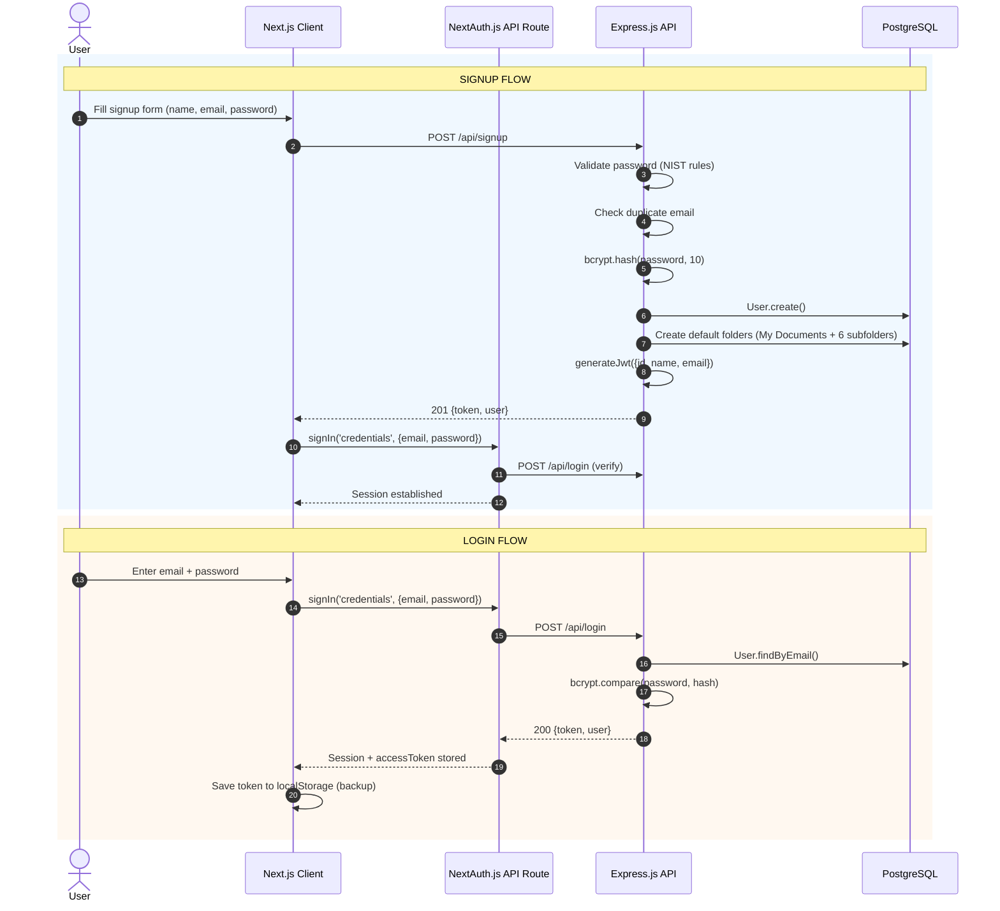

### 6.2 Document Upload Flow

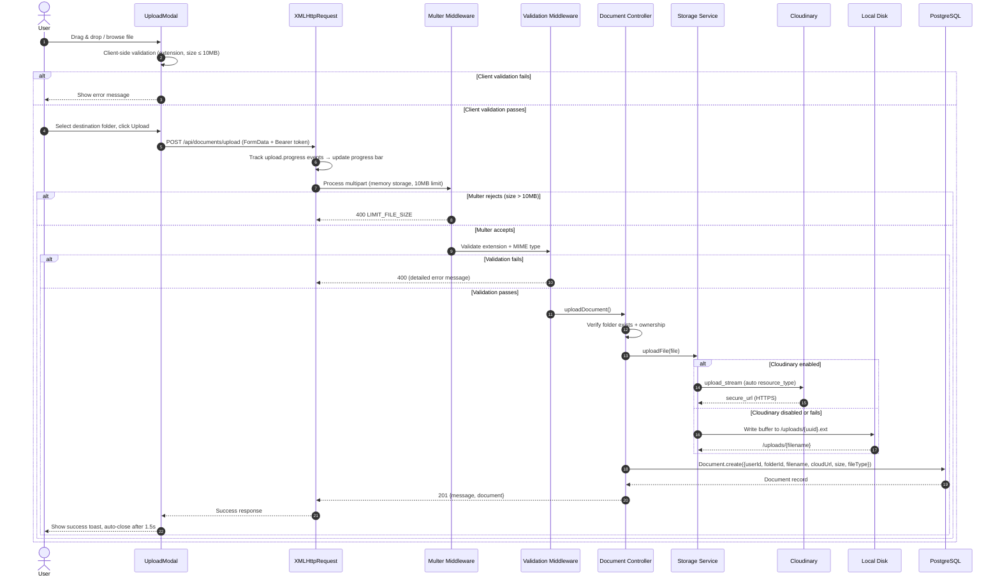

### 6.3 Share Link Lifecycle

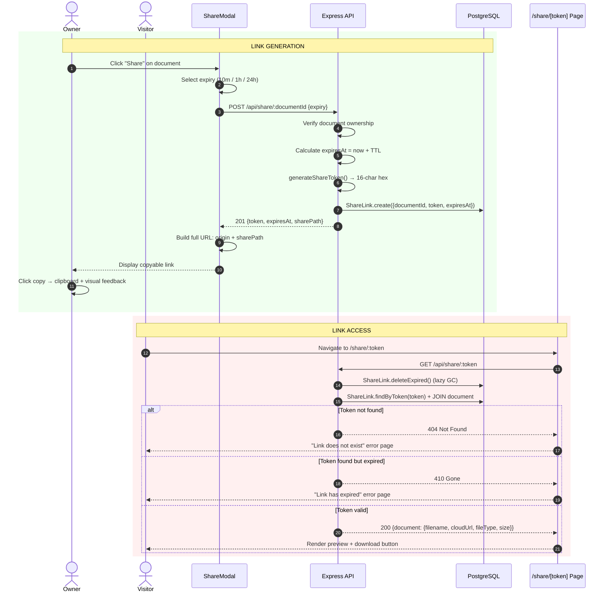

---

## 7. Middleware Pipeline Architecture

Every request passes through a layered middleware pipeline before reaching the controller:

```mermaid
graph LR
    Request["Incoming HTTP Request"]
    CORS["1. CORS\n(Origin whitelist)"]
    JSON["2. Body Parser\n(JSON + URL)"]
    Static["3. Static Files\n(/uploads serve)"]
    Auth["4. JWT Auth\n(Bearer token verify)"]
    Upload["5. Multer\n(Memory storage, 10MB)"]
    Validate["6. File Validation\n(Extension + MIME)"]
    Controller["7. Controller\n(Business Logic)"]
    Error["Error Middleware\n(Catch-all handler)"]

    Request --> CORS --> JSON --> Static
    Static --> Auth -->|"Protected Routes"| Upload
    Upload -->|"Upload Routes Only"| Validate
    Validate --> Controller
    Static -->|"Public Routes"| Controller
    Controller -.->|"On Error"| Error

    style CORS fill:#e3f2fd
    style Auth fill:#fff3e0
    style Upload fill:#fce4ec
    style Validate fill:#fce4ec
    style Error fill:#ffebee
```

> [!NOTE]
> **Route-specific middleware application:**
> - Auth routes (`/api/signup`, `/api/login`, `/api/auth/google`) skip JWT middleware
> - Share GET route (`/api/share/:token`) is public — no auth required
> - Only the upload route chains Multer + Validation middleware

---

## 8. Storage Architecture

### 8.1 Dual Storage Strategy

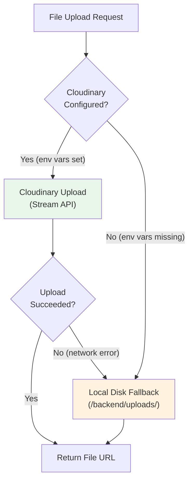

### 8.2 URL Resolution

| Storage Provider | URL Format | Served By |
|---|---|---|
| **Cloudinary** | `https://res.cloudinary.com/{cloud}/.../{public_id}.ext` | Cloudinary CDN |
| **Local Disk** | `/uploads/{uuid}.ext` | Express static middleware |

> Frontend's `getAbsoluteFileUrl()` resolves relative `/uploads/` paths by prepending `NEXT_PUBLIC_BACKEND_URL`.

---

## 9. Security Architecture

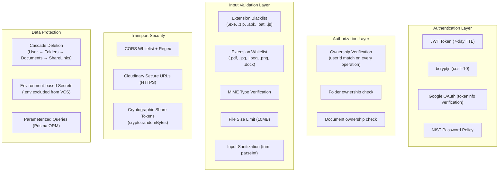

---

## 10. Deployment Architecture

### 10.1 Docker Compose Topology

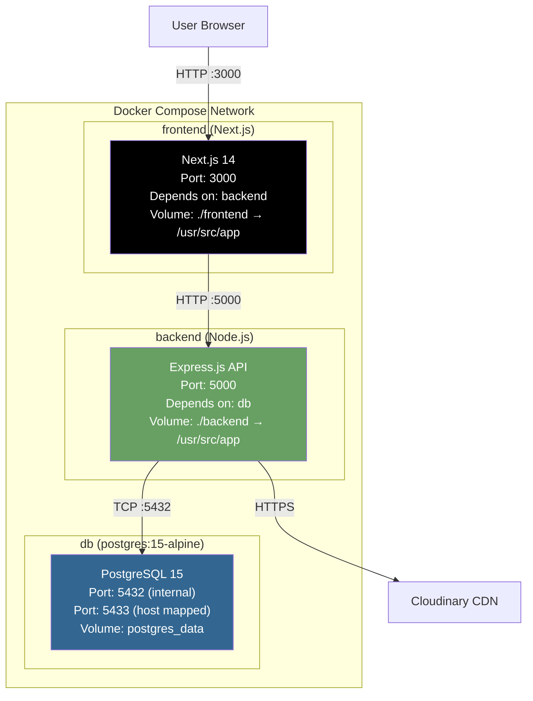

### 10.2 Production Deployment

| Component | Host | URL |
|---|---|---|
| Frontend | Vercel | `https://doc-vault-amber.vercel.app` |
| Backend | Render / Railway | Custom domain on port 5000 |
| Database | Neon / Supabase / Railway PostgreSQL | Connection via `DATABASE_URL` |
| File Storage | Cloudinary | `https://res.cloudinary.com/{cloud}/...` |

---

## 11. Environment Configuration Matrix

| Variable | Service | Required | Default |
|---|---|---|---|
| `PORT` | Backend | No | `5000` |
| `NODE_ENV` | Both | No | `development` |
| `DATABASE_URL` | Backend | **Yes** | — |
| `JWT_SECRET` | Backend | **Yes** | Hardcoded fallback (dev only) |
| `JWT_EXPIRES_IN` | Backend | No | `7d` |
| `FRONTEND_URL` | Backend | No | `http://localhost:3000` |
| `CLOUDINARY_CLOUD_NAME` | Backend | No | — (falls back to local) |
| `CLOUDINARY_API_KEY` | Backend | No | — |
| `CLOUDINARY_API_SECRET` | Backend | No | — |
| `GOOGLE_CLIENT_ID` | Backend | For Google OAuth | — |
| `NEXT_PUBLIC_BACKEND_URL` | Frontend | No | `http://localhost:5000` |
| `NEXTAUTH_SECRET` | Frontend | **Yes** | — |
| `NEXTAUTH_URL` | Frontend | **Yes** | `http://localhost:3000` |
