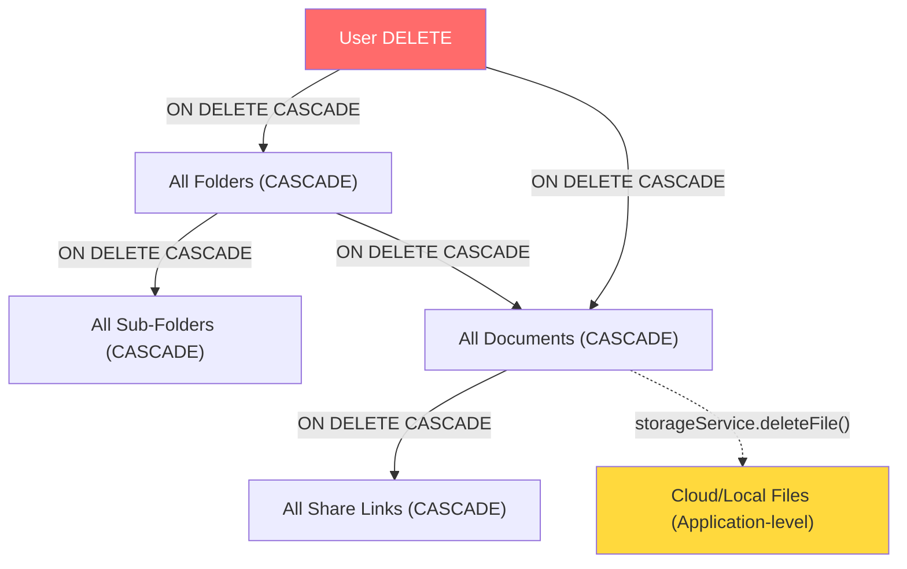
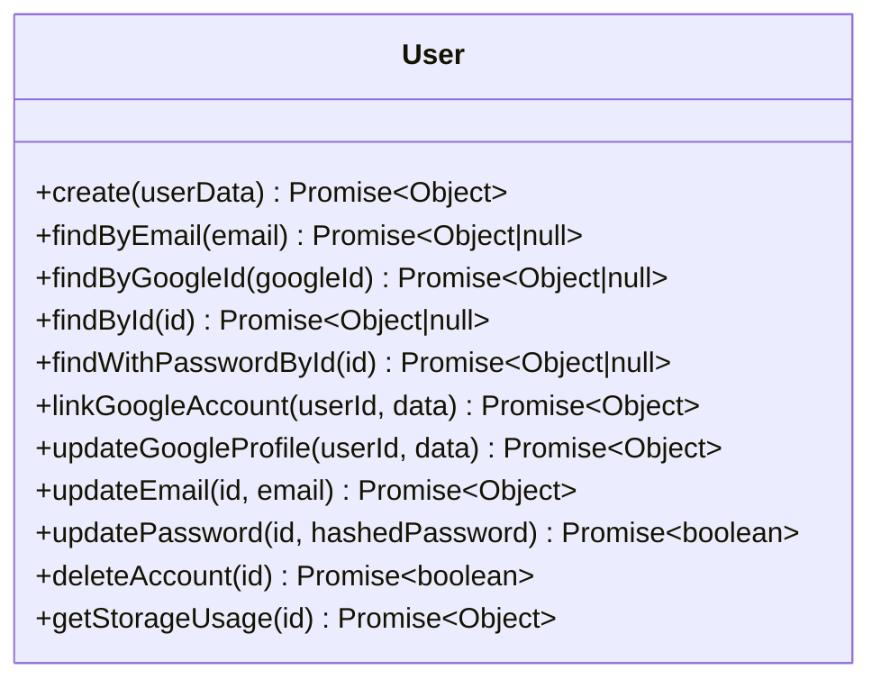
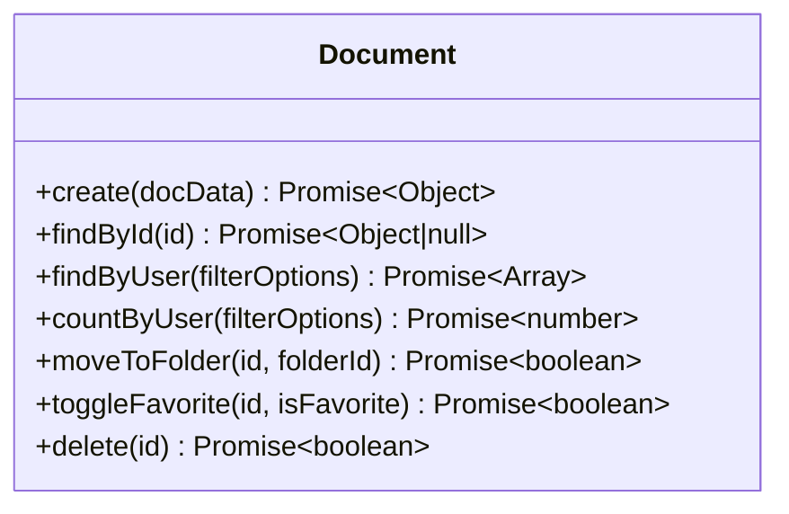
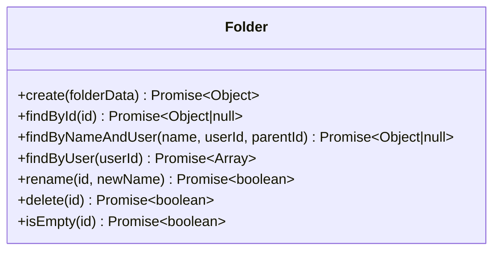
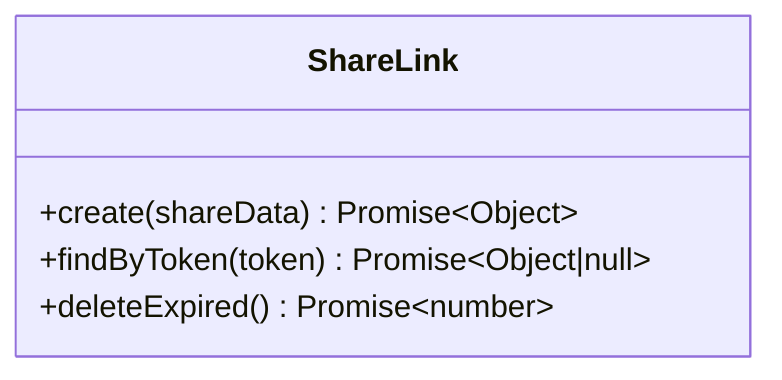
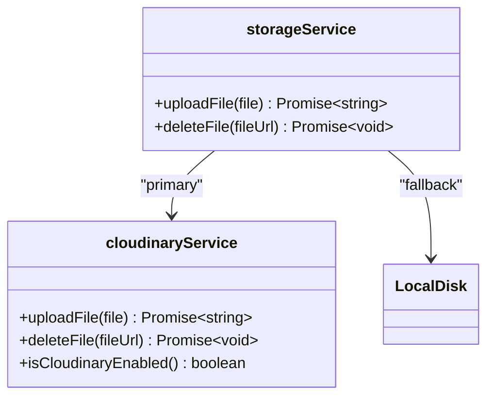
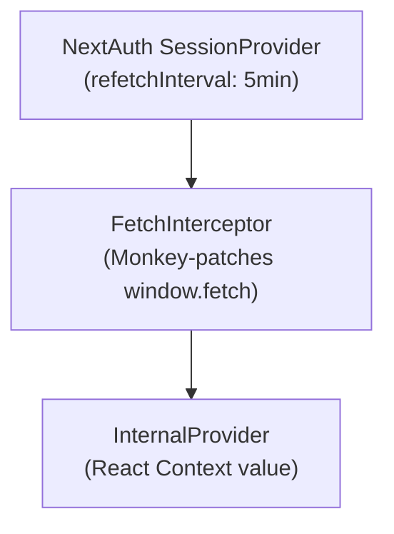

# 🔬 Low-Level Design (LLD)
## DigiLocker Document Vault — Module-Level Technical Specification

---

> **Revision**: 1.0 | **Date**: August 17, 2026  
> **Scope**: Every module, class, function, middleware, and component in the codebase

---

## Table of Contents

1. [Backend Module Architecture](#1-backend-module-architecture)
2. [Database Schema (Prisma)](#2-database-schema-prisma)
3. [Model Layer (Data Access)](#3-model-layer-data-access)
4. [Controller Layer (Business Logic)](#4-controller-layer-business-logic)
5. [Middleware Layer](#5-middleware-layer)
6. [Service Layer (Storage)](#6-service-layer-storage)
7. [Utility Modules](#7-utility-modules)
8. [Route Definitions](#8-route-definitions)
9. [Server Entry Point](#9-server-entry-point)
10. [Frontend Component Architecture](#10-frontend-component-architecture)
11. [State Management (AuthContext)](#11-state-management-authcontext)
12. [Frontend Utilities](#12-frontend-utilities)
13. [Next.js Middleware (Route Protection)](#13-nextjs-middleware-route-protection)
14. [Docker & Deployment Configuration](#14-docker--deployment-configuration)

---

## 1. Backend Module Architecture

### 1.1 Complete Module Dependency Graph

```mermaid
graph TD
    server["server.js (Entry)"]

    server --> authRoutes["routes/authRoutes.js"]
    server --> folderRoutes["routes/folderRoutes.js"]
    server --> documentRoutes["routes/documentRoutes.js"]
    server --> shareRoutes["routes/shareRoutes.js"]
    server --> errorMW["middleware/errorMiddleware.js"]

    authRoutes --> authCtrl["controllers/authController.js"]
    authRoutes --> authMW["middleware/authMiddleware.js"]
    folderRoutes --> folderCtrl["controllers/folderController.js"]
    folderRoutes --> authMW
    documentRoutes --> docCtrl["controllers/documentController.js"]
    documentRoutes --> authMW
    documentRoutes --> uploadMW["middleware/uploadMiddleware.js"]
    documentRoutes --> validMW["middleware/validationMiddleware.js"]
    shareRoutes --> shareCtrl["controllers/shareController.js"]
    shareRoutes --> authMW

    authCtrl --> userModel["models/User.js"]
    authCtrl --> folderModel["models/Folder.js"]
    authCtrl --> tokenUtil["utils/token.js"]
    authCtrl --> pwUtil["utils/passwordValidator.js"]

    docCtrl --> docModel["models/Document.js"]
    docCtrl --> folderModel
    docCtrl --> storageSvc["services/storageService.js"]

    folderCtrl --> folderModel
    shareCtrl --> shareModel["models/ShareLink.js"]
    shareCtrl --> docModel
    shareCtrl --> tokenUtil

    storageSvc --> cloudSvc["services/cloudinaryService.js"]

    userModel --> db["config/db.js"]
    docModel --> db
    folderModel --> db
    shareModel --> db

    db --> prisma["@prisma/client"]
    db --> pg["pg (PostgreSQL driver)"]
    db --> adapter["@prisma/adapter-pg"]

    authMW --> jwt["jsonwebtoken"]
    authCtrl --> bcrypt["bcryptjs"]
    tokenUtil --> jwt
    tokenUtil --> crypto["crypto (Node.js built-in)"]

    cloudSvc --> cloudinary["cloudinary.v2"]
    cloudSvc --> uuid["uuid.v4"]
    storageSvc --> uuid
    storageSvc --> fs["fs (Node.js built-in)"]

    uploadMW --> multer["multer (memoryStorage)"]

    style server fill:#1a1a2e,color:#fff
    style db fill:#336791,color:#fff
```



### 1.2 File Inventory

| Directory | File | Size | Purpose |
|---|---|---|---|
| `config/` | `db.js` | 1,141B | Prisma client initialization with pg adapter, connection pool |
| `config/` | `storage.js` | 934B | GCS client initialization (legacy, not actively used) |
| `controllers/` | `authController.js` | 8,165B | Signup, login, Google OAuth, profile CRUD, account deletion |
| `controllers/` | `documentController.js` | 5,453B | Upload, list, delete, move, toggle favorite |
| `controllers/` | `folderController.js` | 3,777B | Create, list, rename, delete folders |
| `controllers/` | `shareController.js` | 2,837B | Generate and retrieve share links |
| `middleware/` | `authMiddleware.js` | 942B | JWT Bearer token verification |
| `middleware/` | `errorMiddleware.js` | 1,219B | Centralized error formatting (Prisma, Multer, generic) |
| `middleware/` | `uploadMiddleware.js` | 376B | Multer configuration (memory storage, 10MB limit) |
| `middleware/` | `validationMiddleware.js` | 2,233B | File extension/MIME/size validation |
| `models/` | `User.js` | 3,514B | User CRUD, Google account linking, storage usage aggregation |
| `models/` | `Document.js` | 3,762B | Document CRUD, search, pagination, favorites |
| `models/` | `Folder.js` | 2,670B | Folder CRUD, uniqueness check, emptiness check |
| `models/` | `ShareLink.js` | 1,819B | Share link CRUD, token lookup with JOIN, expired cleanup |
| `routes/` | `authRoutes.js` | 721B | 7 auth endpoints |
| `routes/` | `documentRoutes.js` | 819B | 5 document endpoints |
| `routes/` | `folderRoutes.js` | 486B | 4 folder endpoints |
| `routes/` | `shareRoutes.js` | 496B | 2 share endpoints |
| `services/` | `storageService.js` | 2,214B | Upload/delete with Cloudinary → local fallback |
| `services/` | `cloudinaryService.js` | 3,177B | Cloudinary stream upload, delete, config check |
| `utils/` | `token.js` | 785B | JWT generation, share token generation |
| `utils/` | `passwordValidator.js` | 2,761B | NIST-compliant password validation |
| `prisma/` | `schema.prisma` | 2,366B | Database schema definition |
| `prisma/` | `seed.js` | 1,920B | Test user and default folder seeding |
| — | `server.js` | 3,582B | Express app entry point, CORS, routes, health check |

---

## 2. Database Schema (Prisma)

### 2.1 Prisma Schema Definition

```prisma
// datasource: PostgreSQL via pg adapter
// generator: prisma-client-js

model User {
  id        Int        @id @default(autoincrement())
  name      String     @db.VarChar(255)
  email     String     @unique @db.VarChar(255)
  password  String     @db.VarChar(255)        // bcrypt hash
  image     String?    @db.Text                // Google profile picture URL
  provider  String     @default("credentials") // "credentials", "google", "credentials,google"
  googleId  String?    @unique @db.VarChar(255)
  createdAt DateTime   @default(now()) @db.Timestamp(6)
  updatedAt DateTime   @updatedAt @db.Timestamp(6)
  folders   Folder[]                            // 1:N
  documents Document[]                          // 1:N
  @@map("users")
}

model Folder {
  id        Int        @id @default(autoincrement())
  userId    Int                                 // FK → users.id
  parentId  Int?                                // FK → folders.id (self-ref, nullable for root)
  name      String     @db.VarChar(255)
  createdAt DateTime   @default(now()) @db.Timestamp(6)
  updatedAt DateTime   @updatedAt @db.Timestamp(6)
  user      User       @relation(...)           // CASCADE delete
  parent    Folder?    @relation("FolderToFolder", ...) // CASCADE delete
  children  Folder[]   @relation("FolderToFolder")
  documents Document[]
  @@index([userId], map: "idx_user")
  @@index([parentId], map: "idx_parent")
  @@map("folders")
}

model Document {
  id         Int         @id @default(autoincrement())
  userId     Int                                // FK → users.id
  folderId   Int                                // FK → folders.id
  filename   String      @db.VarChar(255)       // Original filename
  cloudUrl   String      @db.Text               // Cloudinary URL or /uploads/uuid.ext
  fileType   String      @db.VarChar(255)       // MIME type
  size       Int                                // File size in bytes
  isFavorite Boolean     @default(false)
  uploadedAt DateTime    @default(now()) @db.Timestamp(6)
  updatedAt  DateTime    @updatedAt @db.Timestamp(6)
  user       User        @relation(...)         // CASCADE delete
  folder     Folder      @relation(...)         // CASCADE delete
  shareLinks ShareLink[]
  @@index([userId], map: "idx_user_doc")
  @@index([folderId], map: "idx_folder_doc")
  @@map("documents")
}

model ShareLink {
  id         Int      @id @default(autoincrement())
  documentId Int                                // FK → documents.id
  token      String   @unique @db.VarChar(255)  // 16-char hex token
  expiresAt  DateTime @db.Timestamp(6)          // Calculated: now + TTL
  createdAt  DateTime @default(now()) @db.Timestamp(6)
  document   Document @relation(...)            // CASCADE delete
  @@index([token], map: "idx_token")
  @@index([documentId], map: "idx_document")
  @@map("share_links")
}
```

### 2.2 Cascade Deletion Graph



> [!WARNING]
> **Cascade deletion does NOT clean cloud storage files.** When a user deletes their account, Prisma cascades delete all database rows, but Cloudinary/local files remain orphaned. The application-level `deleteDocument()` handler explicitly calls `storageService.deleteFile()`, but bulk cascade via account deletion does not trigger this.

### 2.3 Database Connection Setup

```javascript
// config/db.js — Connection Pipeline
const { PrismaClient } = require('@prisma/client');
const { PrismaPg } = require('@prisma/adapter-pg');
const { Pool } = require('pg');

// 1. Parse DATABASE_URL into pg Pool config
//    - Extracts: user, password, host, port, database
//    - Enables SSL: { rejectUnauthorized: false }
// 2. Create pg Pool → PrismaPg adapter → PrismaClient
// 3. Verify connectivity with prisma.$connect() on startup
```

**Connection Parameters** (parsed from `DATABASE_URL`):
| Parameter | Source | Default |
|---|---|---|
| `user` | URL username | — |
| `password` | URL password | — |
| `host` | URL hostname | — |
| `port` | URL port | `5432` |
| `database` | URL pathname | — |
| `ssl.rejectUnauthorized` | Hardcoded | `false` |

---

## 3. Model Layer (Data Access)

### 3.1 User Model



**Method Specifications:**

| Method | Parameters | Prisma Operation | Returns |
|---|---|---|---|
| `create` | `{name, email, password, image?, provider?, googleId?}` | `db.user.create({data})` | `{id, name, email, image, provider}` |
| `findByEmail` | `email: string` | `db.user.findUnique({where: {email}})` | Full user row or `null` |
| `findByGoogleId` | `googleId: string` | `db.user.findUnique({where: {googleId}})` | Full user row or `null` |
| `findById` | `id: int` | `db.user.findUnique({select: [no password]})` | User without password or `null` |
| `findWithPasswordById` | `id: int` | `db.user.findUnique()` | Full user row (includes password hash) |
| `linkGoogleAccount` | `userId, {name, image, googleId}` | `db.user.update({data: {googleId, provider: 'credentials,google'}})` | `{id, name, email, image, provider}` |
| `getStorageUsage` | `id: int` | `db.document.aggregate({_sum: {size}, _count: {id}})` | `{usedBytes, totalLimitBytes: 100MB, percentage, totalCount}` |

### 3.2 Document Model



**`findByUser` Filter Construction:**

```javascript
// Dynamic WHERE clause construction
const where = { userId: parseInt(userId, 10) };

if (folderId)   where.folderId = parseInt(folderId, 10);
if (isFavorite) where.isFavorite = true;
if (search)     where.filename = { contains: search, mode: 'insensitive' };

// Query execution
db.document.findMany({
  where,
  orderBy: { uploadedAt: 'desc' },
  take: parseInt(limit, 10),   // Pagination: page size
  skip: parseInt(offset, 10)    // Pagination: offset = (page - 1) * limit
});
```

### 3.3 Folder Model



**`isEmpty` Implementation:**

```javascript
// Checks BOTH child folders AND child documents
static async isEmpty(id) {
  const folderId = parseInt(id, 10);
  const childFolders = await db.folder.count({ where: { parentId: folderId } });
  const childDocs = await db.document.count({ where: { folderId } });
  return childFolders === 0 && childDocs === 0;
}
```

### 3.4 ShareLink Model



**`findByToken` — JOIN Query:**

```javascript
// Prisma include: fetches related Document in single query
const shareLink = await db.shareLink.findUnique({
  where: { token },
  include: { document: true }  // JOIN documents table
});

// Returns flattened object:
// { id, documentId, token, expiresAt, createdAt,
//   filename, cloudUrl, fileType, size, userId }
```

**`deleteExpired` — Lazy Garbage Collection:**

```javascript
// Bulk delete all share links where expiresAt < NOW()
const result = await db.shareLink.deleteMany({
  where: { expiresAt: { lt: new Date() } }
});
return result.count;  // Number of expired links cleaned
```

---

## 4. Controller Layer (Business Logic)

### 4.1 Auth Controller

| Function | Route | Logic Summary |
|---|---|---|
| `signup` | `POST /api/signup` | Validate password → check duplicate email → bcrypt hash → User.create → createDefaultFolders → generateJwt → 201 |
| `login` | `POST /api/login` | Find user by email → bcrypt.compare → generateJwt → 200 |
| `googleLogin` | `POST /api/auth/google` | Verify ID token via Google tokeninfo → find/create/link user → generateJwt → 200 |
| `getProfile` | `GET /api/profile` | findById → getStorageUsage → 200 `{user, storage}` |
| `updateEmail` | `PUT /api/user/email` | Check duplicate → User.updateEmail → re-generate JWT → 200 |
| `updatePassword` | `PUT /api/user/password` | Validate new password → verify current password → bcrypt hash → update → 200 |
| `deleteAccount` | `DELETE /api/user` | findById → User.deleteAccount → 200 (cascade deletes all data) |

**`createDefaultFolders` — Auto-provisioning on signup:**

```javascript
async function createDefaultFolders(userId) {
  // 1. Create root folder
  const root = await Folder.create({ userId, parentId: null, name: 'My Documents' });

  // 2. Create 6 sub-categories
  const subfolders = ['Identity', 'Education', 'Finance', 'Employment', 'Medical', 'Others'];
  for (const name of subfolders) {
    await Folder.create({ userId, parentId: root.id, name });
  }
}
```

**Google OAuth Flow (detailed):**

```
1. Client sends { idToken } from Google Sign-In SDK
2. Server verifies token: GET https://oauth2.googleapis.com/tokeninfo?id_token={token}
3. Validation checks:
   - profile.aud === GOOGLE_CLIENT_ID (audience match)
   - profile.email_verified === 'true'
   - profile.email exists
   - profile.sub exists (Google user ID)
4. User resolution:
   a. Find by googleId → update profile → return existing user
   b. Find by email → link Google account → return linked user
   c. Create new user with random bcrypt password → create default folders
5. Generate JWT → return token
```

### 4.2 Document Controller

| Function | Route | Middleware Chain | Logic |
|---|---|---|---|
| `uploadDocument` | `POST /api/documents/upload` | auth → multer → validation | Verify folder ownership → storageService.uploadFile → Document.create → 201 |
| `getDocuments` | `GET /api/documents` | auth | Parse query params (page, limit, folderId, search, favorites) → verify folder if specified → Document.findByUser + countByUser → 200 with pagination metadata |
| `deleteDocument` | `DELETE /api/documents/:id` | auth | findById → verify ownership → storageService.deleteFile → Document.delete → 200 |
| `moveDocument` | `PUT /api/documents/:id/move` | auth | findById → verify doc ownership → verify dest folder ownership → Document.moveToFolder → 200 |
| `toggleFavoriteDocument` | `PUT /api/documents/:id/favorite` | auth | findById → verify ownership → Document.toggleFavorite → 200 |

**Pagination Response Format:**

```json
{
  "documents": [...],
  "pagination": {
    "page": 1,
    "limit": 20,
    "totalDocs": 150,
    "totalPages": 8,
    "hasMore": true    // offset + docs.length < totalDocs
  }
}
```

### 4.3 Folder Controller

| Function | Route | Logic |
|---|---|---|
| `createFolder` | `POST /api/folders` | Sanitize name → verify parent ownership → check name uniqueness within parent → Folder.create → 201 |
| `getFolders` | `GET /api/folders` | Folder.findByUser → 200 (sorted by name ASC) |
| `renameFolder` | `PUT /api/folders/:id` | findById → verify ownership → check uniqueness of new name → Folder.rename → 200 |
| `deleteFolder` | `DELETE /api/folders/:id` | findById → verify ownership → isEmpty check → Folder.delete → 200 |

> [!IMPORTANT]
> **Folder deletion is guarded**: The `isEmpty()` check ensures folders with documents or sub-folders cannot be deleted. Users must relocate or delete contents first.

### 4.4 Share Controller

| Function | Route | Logic |
|---|---|---|
| `createShareLink` | `POST /api/share/:documentId` | Verify doc ownership → calculate TTL → generate token → ShareLink.create → 201 |
| `getSharedDocument` | `GET /api/share/:token` | **Lazy GC**: deleteExpired() → findByToken → check expiry → 200/404/410 |

**TTL Calculation:**

```javascript
let offsetMs = 24 * 60 * 60 * 1000; // default 24h
if (expiry === '10m')  offsetMs = 10 * 60 * 1000;       // 600,000 ms
if (expiry === '1h')   offsetMs = 60 * 60 * 1000;       // 3,600,000 ms
if (expiry === '24h')  offsetMs = 24 * 60 * 60 * 1000;  // 86,400,000 ms

const expiresAt = new Date(Date.now() + offsetMs);
```

**HTTP Status Codes for Share Access:**

| Scenario | Status | Body |
|---|---|---|
| Token valid, not expired | `200 OK` | `{document: {filename, cloudUrl, fileType, size}, expiresAt}` |
| Token not found / revoked | `404 Not Found` | `{error: "This shared link does not exist..."}` |
| Token found but expired | `410 Gone` | `{error: "This link has expired."}` |

---

## 5. Middleware Layer

### 5.1 JWT Auth Middleware

```javascript
// middleware/authMiddleware.js
// Execution: Extracts Bearer token from Authorization header → jwt.verify → req.user = decoded

// Input:  req.headers.authorization = "Bearer <jwt>"
// Output: req.user = { id: number, email: string, name: string }
// Error:  401 { error: "Access denied" } or { error: "Session expired" }

// JWT Payload Structure:
// {
//   id: 42,
//   name: "Isha Agrawal",
//   email: "isha@example.com",
//   iat: 1723881600,
//   exp: 1724486400    // 7 days later
// }
```

### 5.2 Upload Middleware (Multer)

```javascript
// middleware/uploadMiddleware.js
const upload = multer({
  storage: multer.memoryStorage(),  // Stores file in req.file.buffer (RAM)
  limits: { fileSize: 10 * 1024 * 1024 }  // 10 MB hard limit
});

// Usage: upload.single('file')
// Input field name in FormData: 'file'
// Output: req.file = {
//   fieldname: 'file',
//   originalname: 'document.pdf',
//   mimetype: 'application/pdf',
//   buffer: <Buffer>,
//   size: 1234567
// }
```

### 5.3 File Validation Middleware

```javascript
// middleware/validationMiddleware.js — Validation Pipeline

// CONSTANTS:
const ALLOWED_EXTENSIONS = ['.pdf', '.jpg', '.jpeg', '.png', '.docx'];
const ALLOWED_MIME_TYPES = [
  'application/pdf',
  'image/jpeg', 'image/jpg', 'image/png',
  'application/vnd.openxmlformats-officedocument.wordprocessingml.document'
];
const REJECTED_EXTENSIONS = ['.exe', '.zip', '.apk', '.bat', '.js'];

// VALIDATION ORDER:
// 1. Check req.file exists              → 400 "Please select a file"
// 2. Extension BLACKLIST check           → 400 "Files with .exe are prohibited"
// 3. Extension WHITELIST check           → 400 "Only PDF, JPG... are allowed"
// 4. MIME type verification              → 400 "File metadata claims to be..."
//    Special case: .docx + application/octet-stream → allowed
// 5. File size check (≤ 10,485,760 B)   → 400 "Maximum size is 10 MB"
// 6. next()                              → Pass to controller
```

### 5.4 Error Middleware

```javascript
// middleware/errorMiddleware.js — Centralized Error Handler

// Prisma Error Codes:
// P2002 → 409 "This email is already registered"
// P1002 / ECONNREFUSED → 503 "Database connection failed"

// Multer Error Codes:
// LIMIT_FILE_SIZE → 400 "File size exceeded limit"

// Generic Errors:
// Any unhandled error → statusCode (default 500) + error message
```

### 5.5 Middleware Execution Order (per route type)

```
PUBLIC AUTH ROUTES (signup, login, google):
  CORS → JSON Parser → URL Parser → Controller → Error Handler

PROTECTED ROUTES (folders, profile):
  CORS → JSON Parser → URL Parser → JWT Auth → Controller → Error Handler

UPLOAD ROUTE:
  CORS → JSON Parser → URL Parser → JWT Auth → Multer(single:'file') → File Validation → Controller → Error Handler

PUBLIC SHARE ACCESS:
  CORS → JSON Parser → URL Parser → Controller → Error Handler
```

---

## 6. Service Layer (Storage)

### 6.1 Storage Service (Abstraction Layer)



**Upload Decision Tree:**

```javascript
async function uploadFile(file) {
  // Step 1: Try Cloudinary (if configured)
  if (cloudinaryService.isCloudinaryEnabled()) {
    try {
      return await cloudinaryService.uploadFile(file);
      // Returns: "https://res.cloudinary.com/..."
    } catch (error) {
      console.warn('Cloudinary failed, falling back to local');
    }
  }

  // Step 2: Local disk fallback
  const uniqueName = `${uuidv4()}${path.extname(file.originalname)}`;
  const destPath = path.join(__dirname, '../uploads', uniqueName);
  await fs.promises.writeFile(destPath, file.buffer);
  return `/uploads/${uniqueName}`;
  // Returns: "/uploads/a1b2c3d4-e5f6-7890-abcd-ef1234567890.pdf"
}
```

### 6.2 Cloudinary Service (Implementation)

**Upload Implementation (Stream API):**

```javascript
async function uploadFile(file) {
  return new Promise((resolve, reject) => {
    const uploadStream = cloudinary.uploader.upload_stream(
      {
        resource_type: 'auto',           // Auto-detect (image, video, raw)
        public_id: `documents/${uuidv4()}`,
        original_filename: file.originalname,
        secure: true,                    // Force HTTPS URL
        folder: 'document-vault'         // Cloudinary folder
      },
      (error, result) => {
        if (error) reject(error);
        else resolve(result.secure_url); // HTTPS URL
      }
    );
    uploadStream.end(file.buffer);       // Stream buffer → Cloudinary
  });
}
```

**Delete Implementation (Public ID Extraction):**

```javascript
async function deleteFile(fileUrl) {
  // URL: https://res.cloudinary.com/{cloud}/image/upload/v123/document-vault/documents/uuid.pdf
  const urlParts = fileUrl.split('/');
  const uploadIndex = urlParts.indexOf('upload');
  // Extract everything after 'upload/' and strip version prefix + file extension
  const publicIdWithExt = urlParts.slice(uploadIndex + 1).join('/');
  const publicId = publicIdWithExt.substring(0, publicIdWithExt.lastIndexOf('.'));
  await cloudinary.uploader.destroy(publicId);
}
```

**Configuration Check:**

```javascript
function isCloudinaryEnabled() {
  return !!(
    process.env.CLOUDINARY_CLOUD_NAME &&
    process.env.CLOUDINARY_API_KEY &&
    process.env.CLOUDINARY_API_SECRET
  );
}
```

---

## 7. Utility Modules

### 7.1 Token Utilities

```javascript
// utils/token.js

// JWT Generation
function generateJwt(payload) {
  const secret = process.env.JWT_SECRET || 'document_vault_secret_token_123456789_abcdef';
  const expiresIn = process.env.JWT_EXPIRES_IN || '7d';
  return jwt.sign(payload, secret, { expiresIn });
}
// Input:  { id: 42, email: "user@example.com", name: "User" }
// Output: "eyJhbGciOiJIUzI1NiIsInR5cCI6IkpXVCJ9..."

// Share Token Generation
function generateShareToken() {
  return crypto.randomBytes(8).toString('hex').toUpperCase();
}
// Output: "A1B2C3D4E5F67890" (16-char uppercase hex)
// Entropy: 64 bits (2^64 ≈ 1.8×10^19 possible tokens)
```

### 7.2 Password Validator (NIST SP 800-63B)

```javascript
// utils/passwordValidator.js — Validation Pipeline

function validatePassword(password, context = {}) {
  // 1. Presence check          → "Enter a password."
  // 2. Min length (8 chars)    → "Password must be at least 8 characters."
  // 3. Max length (128 chars)  → "Password must not exceed 128 characters."
  // 4. Common password check   → "This password is too common..."
  //    (Set of 25 known-weak passwords)
  // 5. Contextual check        → "Password must not include your name..."
  //    - App terms: ['docvault', 'digilocker', 'vault']
  //    - User's name parts (split by whitespace/dots/dashes, ≥3 chars)
  //    - Email local part (split by special chars + digits, ≥3 chars)
  //    All checked case-insensitively against normalized password

  return null; // Valid password
}
```

---

## 8. Route Definitions

### 8.1 Auth Routes (`routes/authRoutes.js`)

```javascript
// PUBLIC (no auth middleware)
router.post('/signup',          authController.signup);
router.post('/login',           authController.login);
router.post('/auth/google',     authController.googleLogin);

// PROTECTED (auth middleware applied)
router.get('/profile',          authMiddleware, authController.getProfile);
router.put('/user/email',       authMiddleware, authController.updateEmail);
router.put('/user/password',    authMiddleware, authController.updatePassword);
router.delete('/user',          authMiddleware, authController.deleteAccount);
```

### 8.2 Document Routes (`routes/documentRoutes.js`)

```javascript
router.use(authMiddleware); // All routes require auth

router.post('/upload',          upload.single('file'), validateFileUpload, documentController.uploadDocument);
router.get('/',                 documentController.getDocuments);
router.delete('/:id',           documentController.deleteDocument);
router.put('/:id/move',         documentController.moveDocument);
router.put('/:id/favorite',     documentController.toggleFavoriteDocument);
```

### 8.3 Folder Routes (`routes/folderRoutes.js`)

```javascript
router.use(authMiddleware); // All routes require auth

router.post('/',    folderController.createFolder);
router.get('/',     folderController.getFolders);
router.put('/:id',  folderController.renameFolder);
router.delete('/:id', folderController.deleteFolder);
```

### 8.4 Share Routes (`routes/shareRoutes.js`)

```javascript
// PROTECTED (generating share links requires auth)
router.post('/:documentId', authMiddleware, shareController.createShareLink);

// PUBLIC (accessing shared documents requires no auth)
router.get('/:token', shareController.getSharedDocument);
```

---

## 9. Server Entry Point

### 9.1 Express Configuration (`server.js`)

```javascript
// 1. CORS Configuration
const allowedOrigins = [
  process.env.FRONTEND_URL,
  'http://localhost:3000',
  'http://localhost:5173', 'http://localhost:5174', 'http://localhost:5175',
  'https://doc-vault-amber.vercel.app'
].filter(Boolean);

// Dynamic origin check: allowedOrigins.includes(origin) || /^http:\/\/localhost:\d+$/.test(origin)
// No-origin requests (curl, mobile) → allowed
// Blocked origins → console.warn + CORS error

// 2. Body Parsing
app.use(express.json());
app.use(express.urlencoded({ extended: true }));

// 3. Static File Serving
app.use('/uploads', express.static(path.join(__dirname, 'uploads')));

// 4. Route Mounting
app.use('/api', authRoutes);
app.use('/api/folders', folderRoutes);
app.use('/api/documents', documentRoutes);
app.use('/api/share', shareRoutes);

// 5. System Routes
app.get('/',       (req, res) => res.json({ status: 'online' }));
app.get('/health', async (req, res) => {
  await prisma.$queryRaw`SELECT 1`; // DB connectivity test
  res.json({ status: 'healthy', timestamp, environment });
});

// 6. Error Handling (registered LAST)
app.use(errorMiddleware);
app.use((req, res) => res.status(404).json({ error: 'API endpoint not found' }));

// 7. Process-level Error Handler
process.on('unhandledRejection', (reason, promise) => console.error(...));
```

---

## 10. Frontend Component Architecture

### 10.1 Component Hierarchy

```
RootLayout (layout.jsx)
├── ErrorBoundary
│   └── AuthProvider (SessionProvider + InternalProvider)
│       └── FetchInterceptor (Global auth token injection)
│           └── GlobalPromptHandler
│               └── [Page Content]
│
├── Landing Page (page.jsx) — Marketing/hero page
├── Login Page (login/page.jsx)
├── Register Page (register/page.jsx)
├── Dashboard Page (dashboard/page.jsx)
│   ├── ProtectedRoute
│   ├── Navbar (Search bar + Filters + Profile avatar)
│   ├── Sidebar (Navigation + Folder tree)
│   ├── Header (Breadcrumbs)
│   ├── Statistics Section (4 stat cards)
│   ├── DocumentList (Table view) / DocumentCard (Grid view)
│   ├── UploadModal (Drag & drop upload)
│   ├── ShareModal (Link generation)
│   ├── MoveModal (Folder relocation)
│   ├── ConfirmModal (Delete confirmations)
│   └── DocumentViewer (Full preview modal)
├── Profile Page (profile/page.jsx)
├── Security Page (security/page.jsx)
├── Share Page (share/[token]/page.jsx) — Public shared document viewer
├── Privacy Policy (privacy-policy/page.jsx)
├── Terms of Service (terms-of-service/page.jsx)
└── Not Found (not-found.jsx) — 404 page
```

### 10.2 Component Props & State Contracts

#### Navbar
```typescript
Props: { folders: Folder[] }
Internal State: {
  showProfileMenu: boolean,
  showFilters: boolean,
  draftFilters: Record<string, string>
}
URL Params Read: search, scope, folder, dateFrom, dateTo, type, size, favorites, sort
Key Methods:
  - updateParams(updates) → router.replace(queryString)
  - handleSearchChange(e) → debounced URL param update
  - applyFilters() → commit draft filters to URL
  - resetFilters() → clear all URL filter params
```

#### Sidebar
```typescript
Props: {
  folders: Folder[],
  activeFolderId: number | null,
  onSelectFolder: (id: number | null) => void,
  onNewFolder: () => void,
  onRenameFolder: (folder: Folder) => void,
  onDeleteFolder: (folder: Folder) => void,
  loading: boolean,
  isFavoritesActive: boolean,
  onSelectFavorites: () => void
}
Internal State: { openMenuFolderId: number | null }
Filtering: Displays folders where parentId !== null (excludes root "My Documents")
```

#### DocumentList (Table View)
```typescript
Props: {
  documents: Document[],
  onShare: (doc) => void,
  onDelete: (doc) => void,
  onMove: (doc) => void,
  loading: boolean,
  onDocumentClick: (doc) => void,
  onToggleFavorite: (docId: number) => void
}
Renders: <table> with columns: Name, Size, Date, Actions
Actions per row: Favorite, Preview, Download, Share, Move, Delete
```

#### DocumentCard (Grid View)
```typescript
Props: {
  doc: Document,
  onShare: (doc) => void,
  onDelete: (doc) => void,
  onMove: (doc) => void,
  onToggleFavorite: (docId: number) => void
}
Renders: Card with file icon, filename, date, size, action buttons
```

#### DocumentViewer (Preview Modal)
```typescript
Props: {
  doc: Document,
  onClose: () => void,
  onShare: (doc) => void,
  onMove: (doc) => void,
  onDelete: (doc) => void,
  allDocuments: Document[]   // For previous/next navigation
}
Internal State: { isFullscreen: boolean, currentIndex: number }
Preview rendering:
  - Image →  tag with error fallback SVG
  - PDF   → <iframe> with #toolbar=0
  - DOCX  → Placeholder with download prompt
  - Other → Generic file placeholder
Navigation: Previous/Next buttons with "X of N" counter
```

#### UploadModal
```typescript
Props: {
  isOpen: boolean,
  onClose: () => void,
  folders: Folder[],
  currentFolderId: number,
  onUploadSuccess: () => void,
  token: string              // JWT for XHR auth header
}
Internal State: {
  dragActive: boolean,
  selectedFile: File | null,
  targetFolderId: string,
  errorMsg: string,
  successMsg: string,
  isUploading: boolean,
  uploadProgress: number     // 0-100
}
Upload mechanism: XMLHttpRequest (not fetch) for progress tracking
  - xhr.upload.addEventListener('progress', ...) → setUploadProgress
  - xhr.setRequestHeader('Authorization', `Bearer ${token}`)
Client validation:
  - REJECTED_EXTENSIONS: ['.exe', '.zip', '.apk', '.bat', '.js']
  - ALLOWED_EXTENSIONS: ['.pdf', '.jpg', '.jpeg', '.png', '.docx']
  - MAX_FILE_SIZE: 10 * 1024 * 1024 (10 MB)
```

#### ShareModal
```typescript
Props: { isOpen: boolean, onClose: () => void, doc: Document }
Internal State: {
  expiry: '10m' | '1h' | '24h',
  shareLink: string,
  loading: boolean,
  copied: boolean,
  errorMsg: string
}
Flow: Select expiry → Generate → Display copyable URL → Copy to clipboard
URL construction: `${window.location.origin}${data.sharePath}`
```

#### MoveModal
```typescript
Props: {
  isOpen: boolean,
  onClose: () => void,
  doc: Document,
  folders: Folder[],
  onMoveSuccess: () => void
}
Internal State: { targetFolderId: string, loading: boolean, errorMsg: string }
Validation: Cannot move to current folder (same folderId check)
```

---

## 11. State Management (AuthContext)

### 11.1 AuthContext Provider Stack



### 11.2 Context Value API

```typescript
interface AuthContextValue {
  user: { name: string, email: string, image?: string } | null;
  token: string | null;           // session.accessToken
  loading: boolean;                // status === 'loading'
  login(email, password): Promise; // signIn('credentials', ...)
  logout(): Promise;               // signOut({ redirect: false })
  signup(name, email, password): Promise;   // POST /api/signup → signIn
  register(name, email, password): Promise; // Alias for signup
}
```

### 11.3 FetchInterceptor (Global Auth Injection)

```javascript
// Monkey-patches window.fetch to automatically inject Authorization header
// for all API calls (URLs containing '/api/', 'localhost:5000', or 'onrender.com')

// Token resolution priority:
// 1. session.accessToken (NextAuth session)
// 2. localStorage.getItem('token') (backup fallback)

// On 401 response: logs warning, lets NextAuth handle refresh
```

### 11.4 Token Persistence

```
Session Token Flow:
  NextAuth session → session.accessToken → AuthContext.token
                                        → localStorage.setItem('token', ...)

Token Usage:
  FetchInterceptor → reads session.accessToken || localStorage.token
  UploadModal XHR  → reads AuthContext.token (prop passed explicitly)
  MoveModal        → reads localStorage.token (direct access)
```

---

## 12. Frontend Utilities

### 12.1 API Client (`utils/apiClient.js`)

```typescript
// Authenticated fetch wrapper using NextAuth session
async function apiFetch(endpoint: string, options?: RequestInit): Promise<Response>
async function apiGet(endpoint: string): Promise<Response>
async function apiPost(endpoint: string, data: object): Promise<Response>
async function apiPut(endpoint: string, data: object): Promise<Response>
async function apiDelete(endpoint: string): Promise<Response>

// Base URL: process.env.NEXT_PUBLIC_BACKEND_URL || 'http://localhost:5000'
// Auth: getSession() → session.accessToken → Authorization: Bearer <token>
```

### 12.2 Download Helper (`utils/downloadHelper.js`)

```javascript
// Forces download instead of browser opening the file
function forceDownload(url, filename) {
  // Creates hidden <a> element with download attribute
  // Sets href to file URL, triggers click, removes element
}
```

### 12.3 URL Resolution (`DocumentCard.jsx` — exported)

```javascript
function getAbsoluteFileUrl(url) {
  if (url.startsWith('http')) return url;  // Cloudinary URL
  const backend = NEXT_PUBLIC_BACKEND_URL || 'http://localhost:5000';
  return `${backend}${url}`;               // Local: /uploads/file.pdf → http://localhost:5000/uploads/file.pdf
}
```

### 12.4 File Size Formatting (`DocumentCard.jsx` — exported)

```javascript
function formatBytes(bytes, decimals = 2) {
  // 0 → "0 Bytes"
  // 1024 → "1 KB"
  // 1048576 → "1 MB"
  // Uses: ['Bytes', 'KB', 'MB', 'GB']
}
```

---

## 13. Next.js Middleware (Route Protection)

### 13.1 Middleware Configuration (`frontend/middleware.ts`)

```typescript
// Route Matching:
export const config = {
  matcher: ['/dashboard/:path*', '/login', '/register', '/share/:path*']
};

// Logic:
// IF authenticated (token.accessToken exists):
//   - /login or /register → Redirect to /dashboard
// IF not authenticated:
//   - /dashboard or /share/* → Redirect to /login

// Note: All routes pass through (authorized: true) — auth check is in middleware function
```

---

## 14. Docker & Deployment Configuration

### 14.1 Docker Compose Services

```yaml
services:
  db:
    image: postgres:15-alpine
    ports: "5433:5432"          # Host port 5433 to avoid conflicts
    volumes: postgres_data      # Persistent data volume
    env: POSTGRES_USER=postgres, POSTGRES_PASSWORD=postgres, POSTGRES_DB=document_vault

  backend:
    build: ./backend/Dockerfile
    ports: "5000:5000"
    depends_on: [db]
    env: DATABASE_URL=postgresql://postgres:postgres@db:5432/document_vault
    volumes: ./backend → /usr/src/app (with node_modules excluded)

  frontend:
    build: ./frontend/Dockerfile
    ports: "3000:3000"
    depends_on: [backend]
    env: NEXT_PUBLIC_BACKEND_URL=http://localhost:5000
    volumes: ./frontend → /usr/src/app (with node_modules excluded)
```

### 14.2 Client-Side Filtering & Sorting Pipeline (Dashboard)

```javascript
// Dashboard page.jsx performs additional client-side filtering on top of server-side results
// Server handles: userId, folderId, search, favorites, pagination
// Client handles: dateFrom, dateTo, typeFilter, sizeFilter, sorting

const filteredDocuments = documents
  .filter(doc => {
    // 1. Search query match (filename contains, case-insensitive)
    // 2. Folder filter (folderId string match)
    // 3. Date range filter (uploadedAt within [dateFrom, dateTo])
    // 4. File type filter (MIME type or extension match)
    // 5. File size filter (5 size buckets: under1MB, 1-10MB, 10-100MB, 100MB-1GB, 1-3GB)
    // 6. Favorites filter (isFavorite === true)
    return all_conditions_pass;
  })
  .sort((a, b) => {
    // newest (default): uploadedAt DESC
    // oldest: uploadedAt ASC
    // az: filename ASC (localeCompare)
    // za: filename DESC
    // largest: size DESC
    // smallest: size ASC
  });
```

### 14.3 Infinite Scroll Implementation

```javascript
// Uses IntersectionObserver API
const observer = new IntersectionObserver(
  (entries) => {
    if (entries[0].isIntersecting && hasMore && !docsLoading) {
      setPage(prev => prev + 1);  // Triggers useEffect → fetchDocuments(page, append=true)
    }
  },
  { threshold: 0.5, rootMargin: '100px' }  // Trigger 100px before element is visible
);

// Observer target: Hidden div at bottom of document list
// <div ref={observerTargetRef} className="load-more-anchor">
//   <div className="skeleton" />  <!-- Loading spinner -->
// </div>
```
