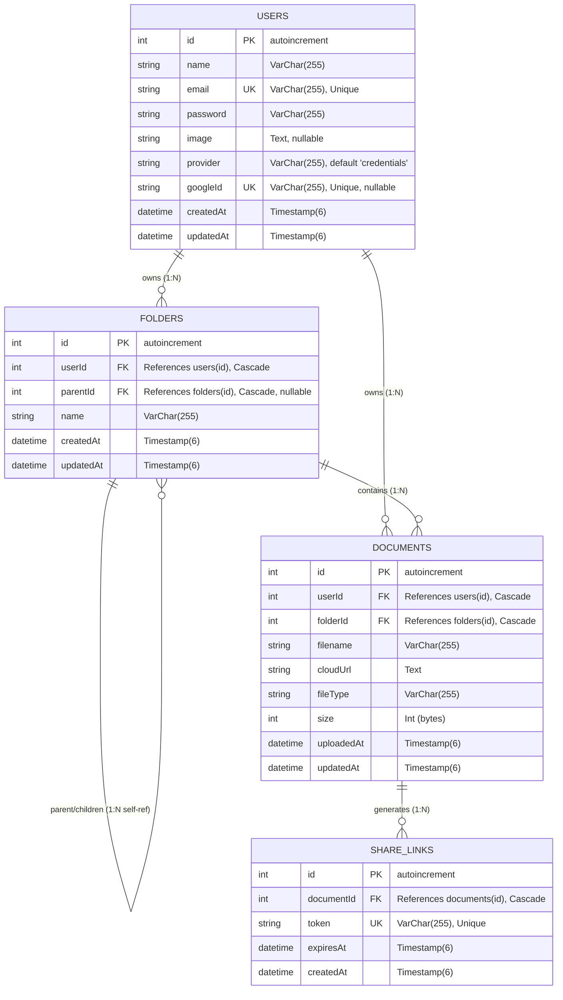
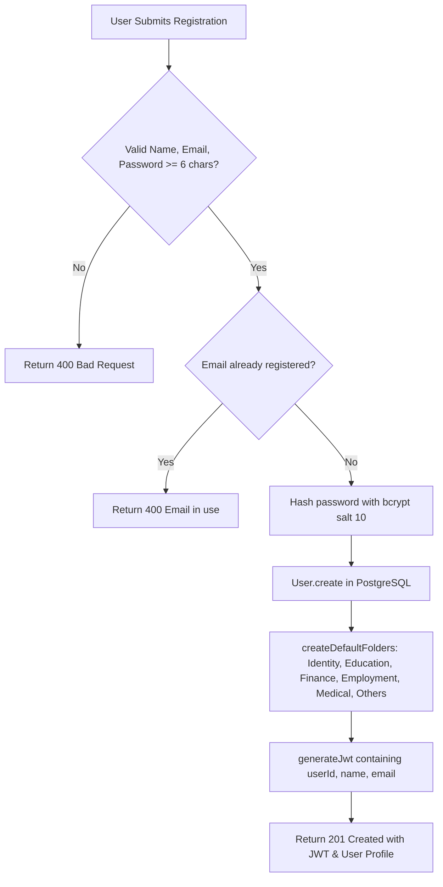
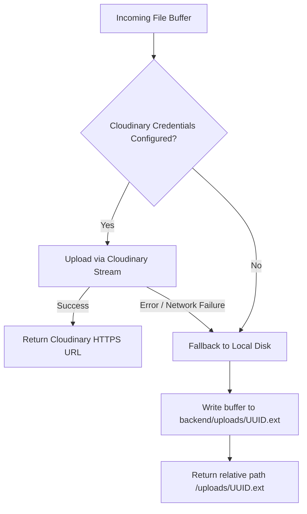
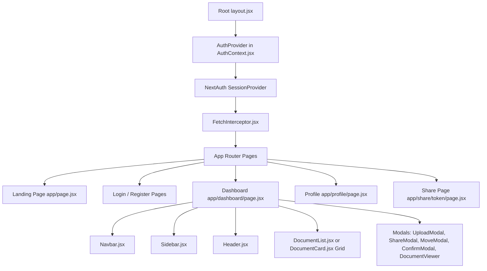
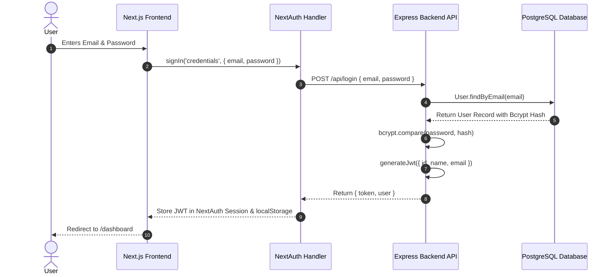
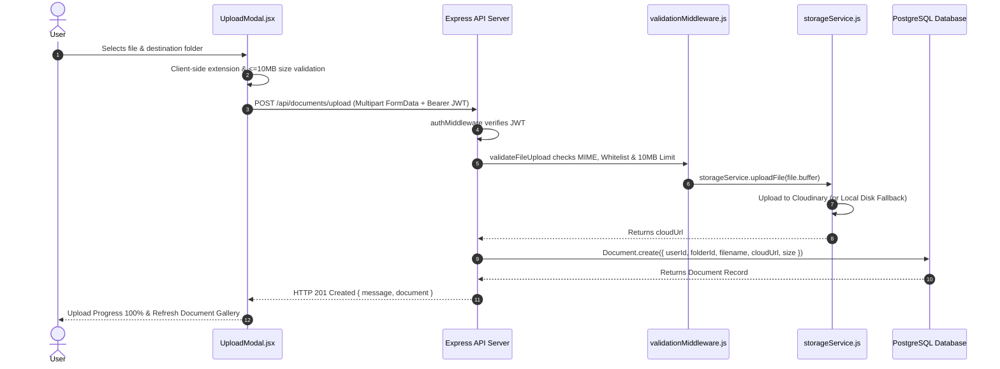
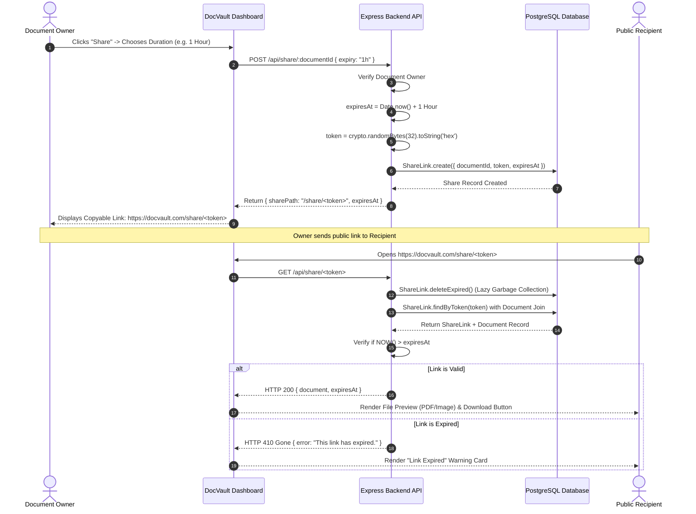
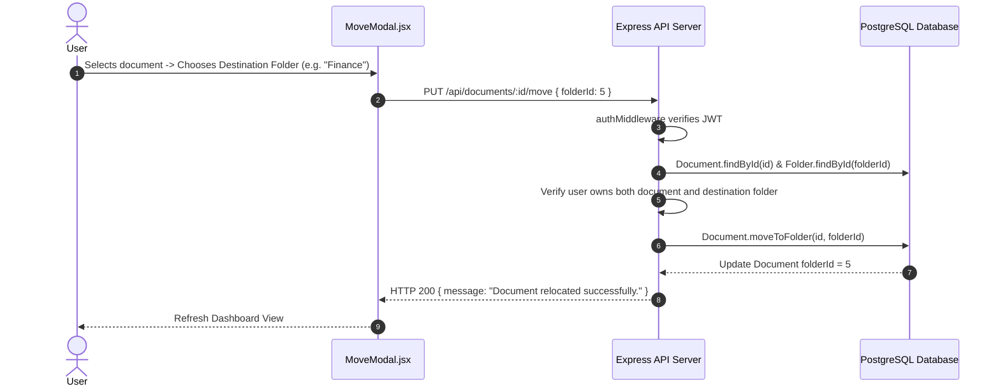

# 📚 DocVault Platform — In-Depth Architecture & Codebase Guide

Welcome to the official, in-depth architecture and codebase guide for **DocVault** (a DigiLocker-inspired Secure Digital Document Vault). This document provides an exhaustive, simplified, and function-by-function explanation of the **Frontend**, **Backend**, and **Database** layers based on the current codebase.

---

## 📑 Table of Contents

1. [System Overview & Architecture Diagram](#1-system-overview--architecture-diagram)
2. [Database Layer (PostgreSQL & Prisma ORM)](#2-database-layer-postgresql--prisma-orm)
   - [2.1 Database Schema & Entity Relationships](#21-database-schema--entity-relationships)
   - [2.2 Data Models & Function-by-Function Breakdown](#22-data-models--function-by-function-breakdown)
     - [`User.js` Model](#userjs-model)
     - [`Folder.js` Model](#folderjs-model)
     - [`Document.js` Model](#documentjs-model)
     - [`ShareLink.js` Model](#sharelinkjs-model)
3. [Backend Layer (Node.js & Express REST API)](#3-backend-layer-nodejs--express-rest-api)
   - [3.1 Server Architecture & Request Lifecycle](#31-server-architecture--request-lifecycle)
   - [3.2 Middleware Engine (What, Why, and How)](#32-middleware-engine-what-why-and-how)
     - [`authMiddleware.js`](#authmiddlewarejs)
     - [`validationMiddleware.js`](#validationmiddlewarejs)
     - [`uploadMiddleware.js`](#uploadmiddlewarejs)
     - [`errorMiddleware.js`](#errormiddlewarejs)
   - [3.3 API Route Handlers & Controllers](#33-api-route-handlers--controllers)
     - [`authController.js`](#authcontrollerjs)
     - [`folderController.js`](#foldercontrollerjs)
     - [`documentController.js`](#documentcontrollerjs)
     - [`shareController.js`](#sharecontrollerjs)
   - [3.4 Storage Engine (Cloudinary CDN & Local Fallback)](#34-storage-engine-cloudinary-cdn--local-fallback)
   - [3.5 Utilities & Helpers](#35-utilities--helpers)
4. [Frontend Layer (Next.js 14 App Router & React 18)](#4-frontend-layer-nextjs-14-app-router--react-18)
   - [4.1 Frontend Component Architecture](#41-frontend-component-architecture)
   - [4.2 Authentication & State Management](#42-authentication--state-management)
     - [`AuthContext.jsx`](#authcontextjsx)
     - [`NextAuth Route ([...nextauth]/route.js)`](#nextauth-route-nextauthroutejs)
     - [`FetchInterceptor.jsx` & `apiClient.js`](#fetchinterceptorjsx--apiclientjs)
   - [4.3 Pages & Routing](#43-pages--routing)
     - [Landing Page (`app/page.jsx`)](#landing-page-apppagejsx)
     - [Authentication Pages (`app/login/page.jsx`, `app/register/page.jsx`)](#authentication-pages)
     - [Dashboard Workspace (`app/dashboard/page.jsx`)](#dashboard-workspace-appdashboardpagejsx)
     - [Profile & Account Settings (`app/profile/page.jsx`)](#profile--account-settings-appprofilepagejsx)
     - [Public Expiring Share Page (`app/share/[token]/page.jsx`)](#public-expiring-share-page-appsharetokenpagejsx)
   - [4.4 Interactive Components & Modal Dialogs](#44-interactive-components--modal-dialogs)
5. [End-to-End System Flowcharts](#5-end-to-end-system-flowcharts)
   - [5.1 User Authentication & Session Issuance Flow](#51-user-authentication--session-issuance-flow)
   - [5.2 Document Upload & Multi-Tier Storage Flow](#52-document-upload--multi-tier-storage-flow)
   - [5.3 Expiring Share Link Lifecycle & Access Flow](#53-expiring-share-link-lifecycle--access-flow)
   - [5.4 Folder Hierarchy & Document Relocation Flow](#54-folder-hierarchy--document-relocation-flow)

---

# 1. System Overview & Architecture Diagram

DocVault uses a 3-tier client-server architecture designed for security, fast file retrieval, and clean separation of concerns.

```
┌─────────────────────────────────────────────────────────────────────────┐
│                              CLIENT TIER                                │
│  Next.js 14 App Router + React 18 + NextAuth.js + Vanilla CSS & Tailwind│
│  - Landing Showcase ('/')                                               │
│  - Interactive Dashboard ('/dashboard') with Infinite Scroll            │
│  - User Profile & Storage Meter ('/profile')                            │
│  - Public Expiring Link Viewer ('/share/[token]')                       │
└────────────────────────────────────┬────────────────────────────────────┘
                                     │ HTTPS / REST (JSON & Multipart FormData)
                                     ▼
┌─────────────────────────────────────────────────────────────────────────┐
│                           APPLICATION TIER                              │
│         Node.js + Express 4 + Prisma ORM + JWT Auth Engine              │
│  - Auth Engine: Bcrypt hashing, Google OAuth token verification, JWT    │
│  - Security: File extension whitelist & blacklist, MIME & size checks   │
│  - Dual Storage: Cloudinary Cloud CDN or Local Static Disk ('/uploads') │
│  - REST Routers: /api/auth, /api/folders, /api/documents, /api/share    │
└───────────────────┬─────────────────────────────────┬───────────────────┘
                    │                                 │
            SQL via │ Prisma Client & pg Pool Adapter │ File Stream Buffer
                    ▼                                 ▼
┌───────────────────────────────────────┐  ┌──────────────────────────────┐
│             DATABASE TIER             │  │         STORAGE TIER         │
│         PostgreSQL Database           │  │ Cloudinary Cloud Storage     │
│ - users (Credentials & Google OAuth)  │  │            OR                │
│ - folders (Recursive Tree Structure)  │  │ Local Disk Fallback Engine   │
│ - documents (Metadata & Cloud URLs)   │  │ (backend/uploads/ UUID files)│
│ - share_links (Expiring Public Tokens)│  │                              │
└───────────────────────────────────────┘  └──────────────────────────────┘
```

---

# 2. Database Layer (PostgreSQL & Prisma ORM)

The database layer uses **PostgreSQL** managed by **Prisma ORM** (`@prisma/client` and `@prisma/adapter-pg` with `pg.Pool`). Database connectivity includes SSL support (`rejectUnauthorized: false`) and connection verification on startup.

## 2.1 Database Schema & Entity Relationships



### Key Architectural Choices in Database Design:
1. **Cascade Deletions (`onDelete: Cascade`)**:
   - Deleting a `User` automatically purges all their folders, documents, and active share links.
   - Deleting a `Document` automatically purges all active `ShareLink` records.
2. **Hierarchical Self-Referential Tree (`Folder -> Folder`)**:
   - `parentId` allows folders to be nested infinitely.
   - The root folder has `parentId = null`.
3. **Database Indices**:
   - `idx_user` and `idx_parent` on `folders`: Speeds up tree queries and directory listings.
   - `idx_user_doc` and `idx_folder_doc` on `documents`: Speeds up dashboard browsing and search.
   - `idx_token` on `share_links`: Guarantees $O(1)$ fast lookups for public link verification.

---

## 2.2 Data Models & Function-by-Function Breakdown

All database model files are located in `backend/models/` and export static classes wrapping Prisma Client operations.

### `User.js` Model

| Method | Parameters | What It Does | Why It Is Needed | How It Works |
| :--- | :--- | :--- | :--- | :--- |
| `create` | `{ name, email, password, image, provider, googleId }` | Inserts a new user record. | Used during standard email signup or when a new user logs in via Google OAuth. | Calls `db.user.create({ data })` and returns the sanitized user object without the password hash. |
| `findByEmail` | `email` | Finds user by email address. | Verifies duplicate emails during signup and authenticates users during login. | Executes `db.user.findUnique({ where: { email } })`. |
| `findByGoogleId` | `googleId` | Finds user by their Google `sub` identifier. | Allows seamless 1-click Google OAuth sign-in for existing users. | Executes `db.user.findUnique({ where: { googleId } })`. |
| `linkGoogleAccount` | `userId`, `{ name, image, googleId }` | Links a Google profile to an existing account. | Lets users who initially signed up with email/password switch to Google login. | Calls `db.user.update` to set `googleId`, avatar, and `provider: 'credentials,google'`. |
| `updateGoogleProfile` | `userId`, `{ name, image }` | Updates name and avatar from Google token. | Keeps profile details synchronized with Google account updates. | Updates user record via `db.user.update`. |
| `findById` | `id` | Fetches safe user profile. | Powers profile view (`GET /api/profile`) without exposing the password hash. | Uses Prisma `select` excluding `password`. |
| `findWithPasswordById`| `id` | Fetches complete user record including password hash. | Required during password change to verify the user's current password. | Executes `db.user.findUnique({ where: { id } })`. |
| `updateEmail` | `id, email` | Updates user's registered email address. | Enables account email updates. | Updates email field via `db.user.update`. |
| `updatePassword` | `id, hashedPassword` | Updates user's password with a new bcrypt hash. | Enables secure password changes. | Replaces the password hash via `db.user.update`. |
| `deleteAccount` | `id` | Deletes user record permanently. | Allows users to delete their account (GDPR compliance). | Calls `db.user.delete`, triggering cascade deletion of all user folders, files, and links. |
| `getStorageUsage` | `id` | Calculates total storage used (bytes), document count, and usage percentage. | Renders storage progress bar in the sidebar and profile page. | Runs `db.document.aggregate` with `_sum: { size: true }` and `_count: { id: true }`. Calculates percentage against a 100 MB quota (`100 * 1024 * 1024` bytes). |

---

### `Folder.js` Model

| Method | Parameters | What It Does | Why It Is Needed | How It Works |
| :--- | :--- | :--- | :--- | :--- |
| `create` | `{ userId, parentId, name }` | Creates a new folder or subfolder. | Allows organizing files into categories. | Inserts a record via `db.folder.create`. |
| `findById` | `id` | Retrieves a folder by its ID. | Validates directory existence and owner permission before uploads or moves. | Calls `db.folder.findUnique({ where: { id } })`. |
| `findByNameAndUser` | `name, userId, parentId` | Checks for folder name duplicate under the same parent. | Prevents duplicate folder names in the same directory level. | Queries `db.folder.findFirst({ where: { name, userId, parentId } })`. |
| `findByUser` | `userId` | Retrieves all folders belonging to a user. | Populates sidebar folder navigation and modal dropdowns. | Calls `db.folder.findMany({ where: { userId }, orderBy: { name: 'asc' } })`. |
| `rename` | `id, newName` | Renames an existing folder. | Allows modifying folder names from the UI. | Updates folder name via `db.folder.update`. |
| `delete` | `id` | Deletes a folder record. | Removes empty folders from the database. | Executes `db.folder.delete({ where: { id } })`. |
| `isEmpty` | `id` | Checks if a folder contains 0 files and 0 subfolders. | Safety check: prevents accidental deletion of folders containing files. | Counts `db.folder.count({ where: { parentId } })` and `db.document.count({ where: { folderId } })`. Returns `true` only if both counts equal `0`. |

---

### `Document.js` Model

| Method | Parameters | What It Does | Why It Is Needed | How It Works |
| :--- | :--- | :--- | :--- | :--- |
| `create` | `{ userId, folderId, filename, cloudUrl, fileType, size }` | Inserts uploaded file metadata. | Records file information after binary upload succeeds. | Calls `db.document.create({ data })`. |
| `findById` | `id` | Retrieves single document metadata. | Verifies file existence and ownership before download, move, share, or delete operations. | Calls `db.document.findUnique({ where: { id } })`. |
| `findByUser` | `{ userId, folderId, search, limit, offset }` | Retrieves a paginated list of documents with optional folder and search filters. | Feeds the main dashboard gallery, folder browsing, and search queries. | Constructs a dynamic `where` object; performs case-insensitive substring search (`contains`, `mode: 'insensitive'`); applies `take` (limit) and `skip` (offset); sorts by `uploadedAt: 'desc'`. |
| `countByUser` | `{ userId, folderId, search }` | Counts total documents matching the active filters. | Calculates total pages for pagination and infinite scroll. | Executes `db.document.count({ where })` with matching filters. |
| `moveToFolder` | `id, folderId` | Updates the document's `folderId`. | Enables moving files between folders. | Updates `folderId` via `db.document.update`. |
| `delete` | `id` | Deletes document metadata from database. | Removes file record when user deletes a document. | Calls `db.document.delete({ where: { id } })`. |

---

### `ShareLink.js` Model

| Method | Parameters | What It Does | Why It Is Needed | How It Works |
| :--- | :--- | :--- | :--- | :--- |
| `create` | `{ documentId, token, expiresAt }` | Inserts an expiring share record. | Grants temporary guest access to a specific document. | Calls `db.shareLink.create({ data })`. |
| `findByToken` | `token` | Retrieves share link and joins document details. | Powers the public `/share/[token]` viewer page. | Uses `db.shareLink.findUnique` with `include: { document: true }` to return token, expiration, filename, size, and cloud URL in one query. |
| `deleteExpired` | *none* | Deletes all records where `expiresAt < NOW()`. | Performs lazy cleanup to remove expired links from the database. | Executes `db.shareLink.deleteMany({ where: { expiresAt: { lt: new Date() } } })`. |

---

# 3. Backend Layer (Node.js & Express REST API)

The backend is built with Express 4, providing REST API endpoints, JWT token issuance and verification, file upload filtering, and dual storage orchestration.

## 3.1 Server Architecture & Request Lifecycle

```mermaid
flowchart TD
    Req[Incoming HTTP Request] --> CORS[CORS Origin Check]
    CORS --> BP[Body Parsers: express.json & urlencoded]
    BP --> Static[/uploads Static File Route]
    Static --> Routers[Express Router Pipeline]
    Routers --> R1[authRoutes: /api/signup, /api/login, /api/profile]
    Routers --> R2[folderRoutes: /api/folders]
    Routers --> R3[documentRoutes: /api/documents]
    Routers --> R4[shareRoutes: /api/share]
    Routers --> Health[GET /health & GET / Status Checks]
    Routers --> ErrMW[Centralized errorMiddleware.js]
    ErrMW --> JSONResp[Standardized JSON Error / Success Response]
```

### Health Check Endpoint (`GET /health`)
Verifies both Express server responsiveness and live database connectivity by running a test query `prisma.$queryRaw\`SELECT 1\``. Returns `200 healthy` or `503 unhealthy`.

---

## 3.2 Middleware Engine (What, Why, and How)

### `authMiddleware.js`
- **What**: Validates JSON Web Tokens (JWT) in the `Authorization: Bearer <token>` HTTP header.
- **Why**: Protects private user endpoints against unauthenticated access.
- **How**:
  1. Extracts header and checks for `Bearer <token>`.
  2. Verifies signature using `jwt.verify(token, process.env.JWT_SECRET)`.
  3. Attaches decoded user payload (`{ id, email, name }`) to `req.user` and calls `next()`.
  4. Returns `401 Unauthorized` if token is invalid or expired.

### `validationMiddleware.js`
- **What**: Enforces security rules and size constraints on file uploads.
- **Why**: Protects the server and users from malicious executable files and storage exhaustion.
- **How**:
  1. **Blacklist Check**: Rejects dangerous extensions (`.exe`, `.zip`, `.apk`, `.bat`, `.js`).
  2. **Whitelist Check**: Only allows `.pdf`, `.jpg`, `.jpeg`, `.png`, `.docx`.
  3. **MIME Verification**: Verifies matching MIME types (`application/pdf`, `image/jpeg`, etc.).
  4. **Size Validation**: Enforces a 10 MB limit (`file.size <= 10 * 1024 * 1024 bytes`).

### `uploadMiddleware.js`
- **What**: Multer memory storage engine.
- **Why**: Holds incoming multipart file uploads in memory (`file.buffer`) so they can be streamed directly to Cloudinary or written to local disk without unnecessary temp files.
- **How**: Configured with `multer.memoryStorage()` and a `10MB` file size limit.

### `errorMiddleware.js`
- **What**: Centralized exception handler.
- **Why**: Catches errors passed from async controllers via `next(error)` and ensures consistent API responses.
- **How**: Formats error messages and returns `{ error: error.message || 'Internal Server Error' }`.

---

## 3.3 API Route Handlers & Controllers

### `authController.js`



- **`signup(req, res, next)`**: Validates inputs, hashes password, saves user, automatically seeds default folders (`Identity`, `Education`, `Finance`, `Employment`, `Medical`, `Others`), generates session JWT, and returns `201 Created`.
- **`login(req, res, next)`**: Finds user by email, validates password hash with `bcrypt.compare`, generates session JWT, and returns `200 OK`.
- **`googleLogin(req, res, next)`**: Verifies Google ID token against `https://oauth2.googleapis.com/tokeninfo`, creates or links the local user account, seeds default folders if new, and returns a signed JWT.
- **`getProfile(req, res, next)`**: Returns user metadata and aggregated storage usage via `User.getStorageUsage()`.
- **`updateEmail(req, res, next)`**: Validates uniqueness, updates email, and returns an updated JWT token.
- **`updatePassword(req, res, next)`**: Verifies current password hash, hashes the new password, and updates database.
- **`deleteAccount(req, res, next)`**: Deletes user record, triggering cascade deletion of all user data.

---

### `folderController.js`

- **`createFolder(req, res, next)`**: Validates folder name, verifies parent folder ownership, ensures no duplicate sibling folder exists at the same directory level, and inserts folder into DB.
- **`getFolders(req, res, next)`**: Retrieves all folders belonging to the user (`Folder.findByUser(userId)`).
- **`renameFolder(req, res, next)`**: Verifies ownership, checks against sibling name collisions, and updates folder name.
- **`deleteFolder(req, res, next)`**: Checks `Folder.isEmpty(id)`. If the folder contains files or subfolders, returns `400 Folder is not empty`. If empty, deletes folder.

---

### `documentController.js`

- **`uploadDocument(req, res, next)`**: Validates destination folder ownership, uploads file buffer via `storageService.uploadFile()`, saves metadata row (`filename`, `cloudUrl`, `fileType`, `size`) in PostgreSQL, and returns `201 Created`.
- **`getDocuments(req, res, next)`**: Retrieves paginated documents with search and folder filtering, returning `documents` and pagination metadata (`page`, `limit`, `totalDocs`, `totalPages`, `hasMore`).
- **`deleteDocument(req, res, next)`**: Verifies user ownership, removes the binary file via `storageService.deleteFile()`, and deletes the database record.
- **`moveDocument(req, res, next)`**: Verifies ownership of both document and destination folder, then updates `document.folderId`.

---

### `shareController.js`

- **`createShareLink(req, res, next)`**: Verifies document ownership, calculates expiration timestamp from duration (`10m`, `1h`, `24h`), generates a 64-character random token (`crypto.randomBytes(32)`), saves share record in database, and returns `{ sharePath: '/share/<token>', expiresAt }`.
- **`getSharedDocument(req, res, next)`**: Runs lazy cleanup `ShareLink.deleteExpired()`, resolves token with document details, checks expiration (`NOW() > expiresAt`), and returns document metadata and download/preview URL.

---

## 3.4 Storage Engine (Cloudinary CDN & Local Fallback)

Located in `backend/services/storageService.js` and `backend/services/cloudinaryService.js`:



- **Cloudinary Mode**: Uploads files to Cloudinary cloud CDN using `cloudinary.uploader.upload_stream`.
- **Local Disk Fallback Mode**: If Cloudinary is not configured or fails, saves file locally to `backend/uploads/` with a unique UUID filename and serves it via Express static middleware.

---

## 3.5 Utilities & Helpers

- **`backend/utils/token.js`**:
  - `generateJwt(payload)`: Signs JWT containing user details (`{ id, name, email }`) with 30-day expiration.
  - `generateShareToken()`: Generates a 64-character hex cryptographic token for secure sharing.

---

# 4. Frontend Layer (Next.js 14 App Router & React 18)

The frontend is built with Next.js 14 App Router and React 18, utilizing the Context API for state management, NextAuth for authentication, and a responsive CSS design system.

## 4.1 Frontend Component Architecture



---

## 4.2 Authentication & State Management

### `AuthContext.jsx`
- **What**: Centralized React Context providing authentication state across the application.
- **Why**: Keeps login status, session data, user profile, and JWT token synchronized.
- **Key Methods**:
  - `login(email, password)`: Calls NextAuth `signIn('credentials', { redirect: false, email, password })`.
  - `signup(name, email, password)` / `register(...)`: POSTs to `${BACKEND}/api/signup`, then automatically signs in.
  - `logout()`: Calls NextAuth `signOut()` and clears token from `localStorage`.
  - Synchronization: Automatically saves `accessToken` to `localStorage` for immediate client access.

### NextAuth Route (`app/api/auth/[...nextauth]/route.js`)
- **What**: NextAuth server route configuring `CredentialsProvider` and `GoogleProvider`.
- **Why**: Integrates NextAuth with the Express/PostgreSQL backend.
- **Callbacks**:
  - `jwt({ token, user, account })`: When logging in with Google, exchanges the Google ID token with backend `/api/auth/google` to receive a backend JWT.
  - `session({ session, token })`: Attaches `accessToken` and user ID to the client-side session.

### `FetchInterceptor.jsx` & `apiClient.js`
- **What**: Intercepts outgoing HTTP `fetch` requests and automatically injects the `Authorization: Bearer <token>` header.
- **Why**: Eliminates manual token management and prevents missing header bugs.

---

## 4.3 Pages & Routing

### Landing Page (`app/page.jsx`)
- **What**: Public landing page with hero banner, live preview graphic (`hero-vault.jpg`), ambient lighting glow, and navigation links.
- **Sections**:
  - **Hero**: Title, subtitle, CTAs ("Get Started", "Learn More"), trust badges (10 MB limit, encrypted storage, expiring links, infinite scroll).
  - **Features**: Showcase cards detailing secure storage, upload limits, expiring links, and instant search.
  - **How It Works**: 3-step workflow (Create Account $\rightarrow$ Upload & Organize $\rightarrow$ Share Securely).
  - **Why Choose Us**: Key advantages including bank-grade encryption, fast search, and zero bloat.
  - **Footer**: Brand links, GitHub, and social links.

### Authentication Pages (`app/login/page.jsx`, `app/register/page.jsx`)
- **What**: User authentication forms.
- **Features**: Real-time form validation, password visibility toggle, error banners, and Google OAuth 1-click login.

### Dashboard Workspace (`app/dashboard/page.jsx`)
- **What**: The primary workspace of DocVault.
- **Features**:
  1. **Folder Navigation**: Displays folder hierarchy; clicking a folder filters document view.
  2. **Grid & List Views**: Toggle between visual card grid and detailed table list.
  3. **Multi-Filter & Search**: Real-time filename search, document type filter (PDF, Image, Word), date range filter, and size filter.
  4. **Infinite Scroll**: Uses `IntersectionObserver` to automatically fetch the next page of 20 documents as the user scrolls.
  5. **Modal Management**: Coordinates state for upload, file preview, move, share, and delete dialogs.

### Profile & Account Settings (`app/profile/page.jsx`)
- **What**: User account and storage management interface.
- **Features**:
  1. **Storage Gauge**: Shows storage used out of 100 MB with a visual progress bar and total file count.
  2. **Update Email Form**: Live email update with validation.
  3. **Update Password Form**: Password change with current password verification.
  4. **Danger Zone**: Delete account with confirmation modal.

### Public Expiring Share Page (`app/share/[token]/page.jsx`)
- **What**: Public page for viewing and downloading files shared via expiring link.
- **Features**:
  1. Resolves token against `GET /api/share/:token`.
  2. In-browser preview for PDFs (iframe) and Images (img).
  3. Displays live expiration timestamp badge.
  4. 1-click direct download button.
  5. Renders a styled "Link Expired" warning card if expired or invalid.

---

## 4.4 Interactive Components & Modal Dialogs

| Component | File Path | Role & Capabilities |
| :--- | :--- | :--- |
| `Navbar.jsx` | `components/Navbar.jsx` | Top navigation bar with brand logo, search input, quick upload button, profile avatar dropdown, and logout trigger. |
| `Sidebar.jsx` | `components/Sidebar.jsx` | Renders "All Documents" link, custom folder list, inline folder creation (`+ New`), folder rename/delete action menus, and active folder highlighting. |
| `Header.jsx` | `components/Header.jsx` | Dashboard header with dynamic breadcrumbs, total document count, and Grid/List view mode toggle. |
| `DocumentCard.jsx` | `components/DocumentCard.jsx` | Grid view card displaying file format icons (PDF/Image/Word), filename, size, quick preview, direct download, and action menu (Share, Move, Delete). |
| `DocumentList.jsx` | `components/DocumentList.jsx` | Table list view displaying Name, Folder, Size, Upload Date, and action buttons. |
| `DocumentViewer.jsx`| `components/DocumentViewer.jsx`| Modal for in-browser viewing of PDFs (interactive iframe), images (zoomable preview), and Word document download banner. |
| `UploadModal.jsx` | `components/UploadModal.jsx` | Drag-and-drop file upload modal with client-side extension and size validation, destination folder picker, and upload progress bar via `XMLHttpRequest` progress events. |
| `ShareModal.jsx` | `components/ShareModal.jsx` | Expiring share link modal. Allows selecting duration (`10m`, `1h`, `24h`), calls backend API, and provides 1-click clipboard link copying. |
| `MoveModal.jsx` | `components/MoveModal.jsx` | Modal allowing users to relocate a document to any user folder. |
| `ConfirmModal.jsx` | `components/ConfirmModal.jsx`| Reusable confirmation dialog for destructive actions (deleting files, folders, or account). |
| `InputModal.jsx` | `components/InputModal.jsx` | Reusable modal for entering text (creating or renaming folders). |
| `ProtectedRoute.jsx`| `components/ProtectedRoute.jsx`| Route guard component that redirects unauthenticated users to `/login`. |
| `ErrorBoundary.jsx` | `components/ErrorBoundary.jsx` | React error boundary catching render exceptions and providing a fallback reload UI. |

---

# 5. End-to-End System Flowcharts

## 5.1 User Authentication & Session Issuance Flow



---

## 5.2 Document Upload & Multi-Tier Storage Flow



---

## 5.3 Expiring Share Link Lifecycle & Access Flow



---

## 5.4 Folder Hierarchy & Document Relocation Flow



---

## 6. Summary of Dependencies & Versions

- **Frontend**: Next.js `^14.2.3`, React `^18.3.1`, NextAuth `^4.24.14`, Lucide Icons `^0.395.0`, Tailwind CSS `^3.4.3`, Axios `^1.7.2`.
- **Backend**: Express `^4.19.2`, Prisma `^7.8.0`, `@prisma/client` `^7.8.0`, `@prisma/adapter-pg` `^7.8.0`, `pg` `^8.22.0`, `jsonwebtoken` `^9.0.2`, `bcryptjs` `^2.4.3`, `multer` `^1.4.5-lts.1`, `cloudinary` `^2.10.0`, `uuid` `^10.0.0`.
