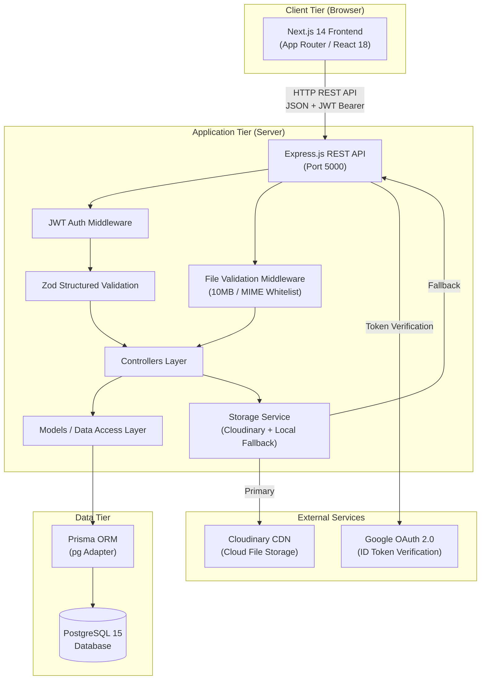
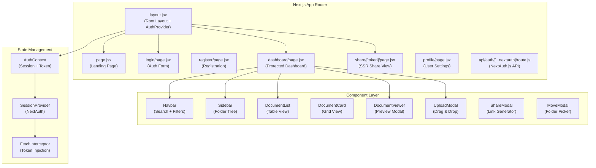
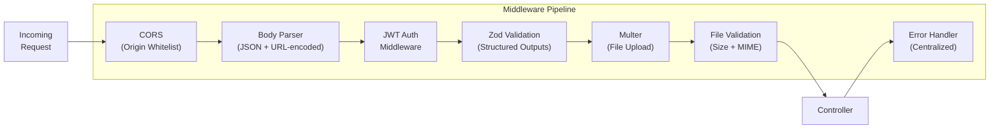
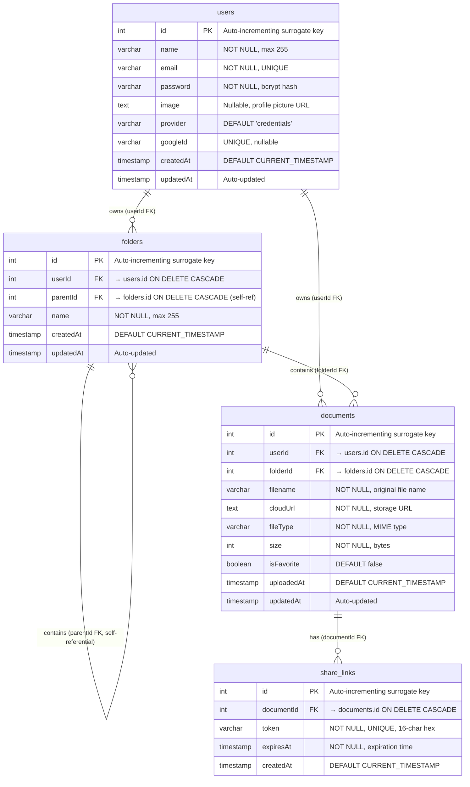
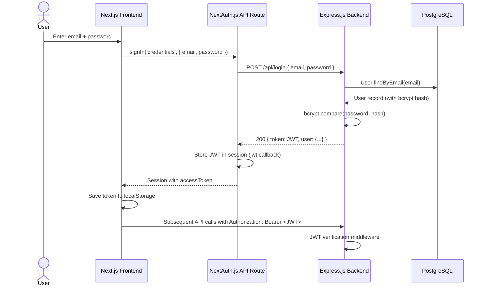
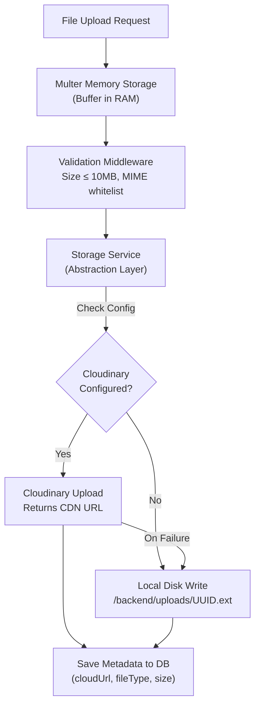
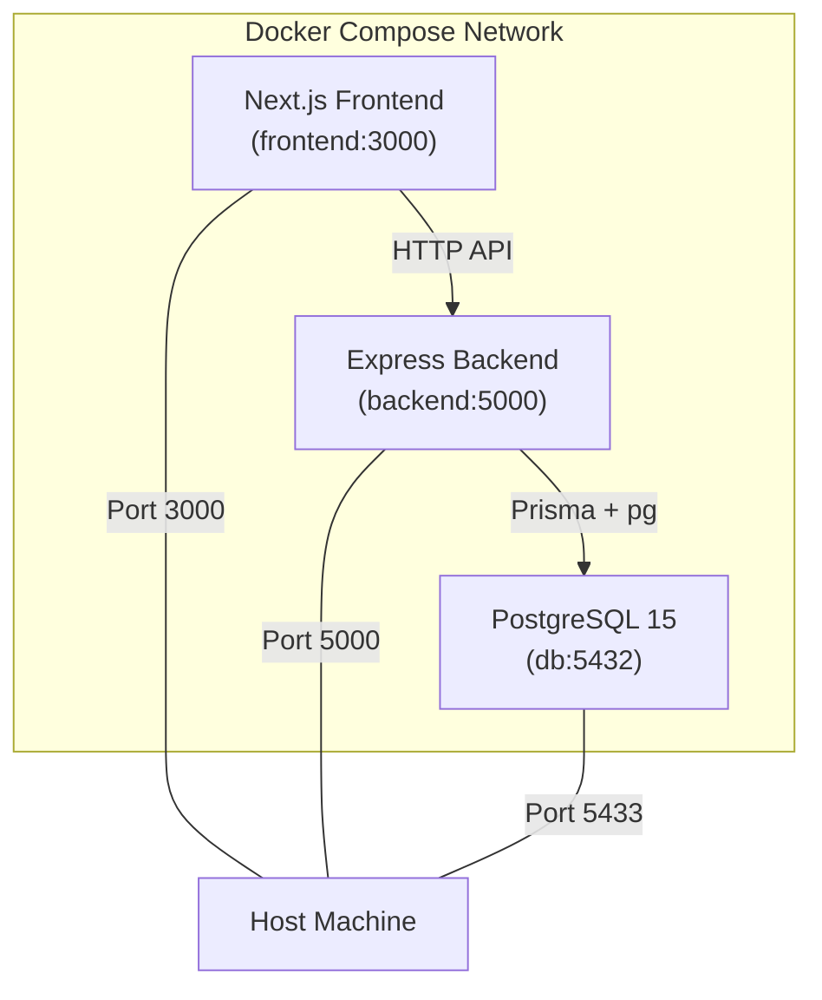
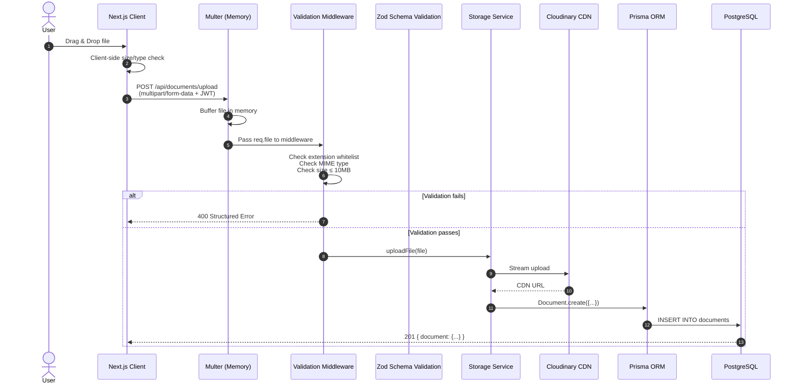

# 🏗️ System Design Document — DigiLocker Document Vault

## CONCEPT: System Design Basics — Frontend, Backend, DB and Other Systems Integration

This document describes the full system architecture of the DigiLocker Document Vault, covering how the **frontend**, **backend**, **database**, and **external services** integrate to deliver a secure, scalable document management platform.

---

## 1. High-Level Architecture Overview

The system follows a **three-tier client-server architecture** with a clear separation between presentation, business logic, and data persistence layers.



---

## 2. Frontend Architecture

### Technology: Next.js 14 (App Router)

The frontend uses **Next.js App Router** for file-system-based routing with React Server Components.



### Client-Side Routing

Next.js App Router provides **file-system-based client-side routing**:
- `/dashboard` → `app/dashboard/page.jsx`
- `/share/[token]` → `app/share/[token]/page.jsx`
- Navigation uses `useRouter().push()` for SPA-like transitions
- URL search params (`useSearchParams`) drive dashboard filters without page reloads

### State Management

- **AuthContext** wraps the app, managing JWT tokens and user sessions
- **NextAuth.js** handles OAuth flows and credential-based authentication
- **localStorage** used as a secondary token cache for API calls

---

## 3. Backend Architecture

### Technology: Express.js (Node.js)

The backend follows a **layered architecture** pattern:

```
Request → Routes → Middleware → Controllers → Models → Prisma → PostgreSQL
```



### Layered Responsibilities

| Layer | Files | Responsibility |
|-------|-------|---------------|
| **Routes** | `routes/*.js` | Define HTTP endpoints, compose middleware chains |
| **Middleware** | `middleware/*.js` | Cross-cutting concerns: auth, validation, error handling |
| **Controllers** | `controllers/*.js` | Business logic, request/response handling |
| **Models** | `models/*.js` | Data access abstraction over Prisma ORM |
| **Services** | `services/*.js` | External service integrations (Cloudinary, local storage) |
| **Config** | `config/*.js` | Database connection, environment configuration |
| **Utils** | `utils/*.js` | JWT generation, password validation, token helpers |

### Structured Output Validation (Zod)

All API request bodies pass through **Zod schema validation middleware** before reaching controllers:

```
POST /api/signup → validateBody(SignupSchema) → authController.signup
POST /api/login  → validateBody(LoginSchema)  → authController.login
```

Invalid payloads receive structured 400 responses:
```json
{
  "error": "Validation failed. Please check the highlighted fields.",
  "details": [
    { "field": "email", "message": "Please provide a valid email address." },
    { "field": "password", "message": "Password must be at least 8 characters long." }
  ]
}
```

---

## 4. Database Design

### Technology: PostgreSQL 15 + Prisma ORM



### Schema Design Decisions

1. **Surrogate Integer PKs**: Auto-incrementing `SERIAL` IDs — simple, performant for JOINs
2. **Cascading Deletes**: All FK relationships use `ON DELETE CASCADE` — deleting a user removes all their folders, documents, and share links
3. **Self-Referential FK**: `folders.parentId` → `folders.id` enables hierarchical folder nesting
4. **Indexes**: Strategic indexes on `userId`, `folderId`, `parentId`, `token`, `documentId` for query optimization
5. **Normalization**: Schema is in **3NF** — no transitive dependencies, no data duplication

---

## 5. Systems Integration

### 5.1 Authentication Flow



### 5.2 File Storage Integration



### 5.3 Docker Compose Orchestration



Services start in dependency order: `db` → `backend` → `frontend`

---

## 6. Data Flow: Document Upload Lifecycle



---

## 7. Security Architecture

| Layer | Mechanism | Purpose |
|-------|-----------|---------|
| **Transport** | HTTPS (production) | Encrypt data in transit |
| **Authentication** | JWT (jsonwebtoken) | Stateless session tokens |
| **Password Storage** | bcryptjs (10 rounds) | One-way hash with salt |
| **CORS** | Origin whitelist | Prevent cross-origin attacks |
| **Input Validation** | Zod schemas | Prevent injection, enforce types |
| **File Validation** | Extension + MIME whitelist | Block executable uploads |
| **File Size Limit** | 10 MB hard limit | Prevent resource exhaustion |
| **Share Links** | Cryptographic UUID + TTL | Time-bound public access |
| **Cascade Deletes** | ON DELETE CASCADE | Prevent orphaned records |

---

## 8. API Endpoint Summary

| Category | Method | Endpoint | Auth | Validation Schema |
|----------|--------|----------|------|-------------------|
| Auth | POST | `/api/signup` | No | `SignupSchema` |
| Auth | POST | `/api/login` | No | `LoginSchema` |
| Auth | POST | `/api/auth/google` | No | — |
| Auth | GET | `/api/profile` | Yes | — |
| Auth | PUT | `/api/user/email` | Yes | `UpdateEmailSchema` |
| Auth | PUT | `/api/user/password` | Yes | `UpdatePasswordSchema` |
| Auth | DELETE | `/api/user` | Yes | — |
| Folders | POST | `/api/folders` | Yes | `CreateFolderSchema` |
| Folders | GET | `/api/folders` | Yes | — |
| Folders | PUT | `/api/folders/:id` | Yes | `RenameFolderSchema` |
| Folders | DELETE | `/api/folders/:id` | Yes | — |
| Documents | POST | `/api/documents/upload` | Yes | File validation middleware |
| Documents | GET | `/api/documents` | Yes | — |
| Documents | PUT | `/api/documents/:id/move` | Yes | `MoveDocumentSchema` |
| Documents | PUT | `/api/documents/:id/favorite` | Yes | `ToggleFavoriteSchema` |
| Documents | DELETE | `/api/documents/:id` | Yes | — |
| Share | POST | `/api/share/:documentId` | Yes | `CreateShareLinkSchema` |
| Share | GET | `/api/share/:token` | No | — |
